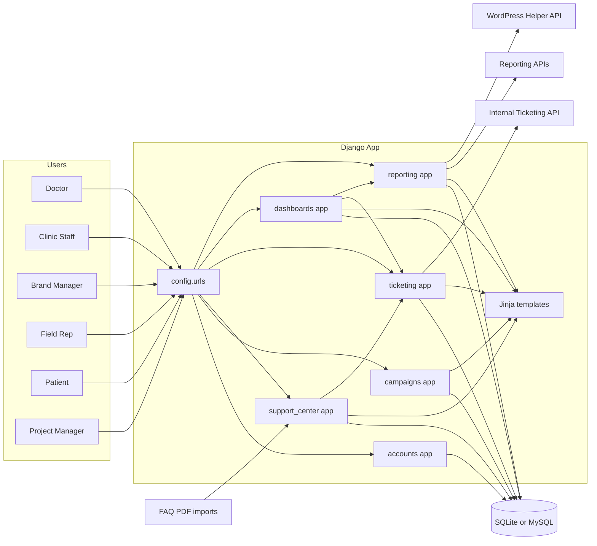
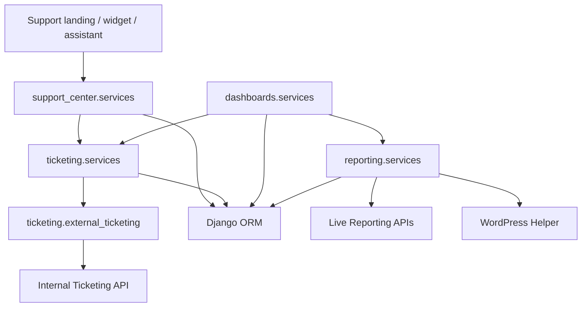
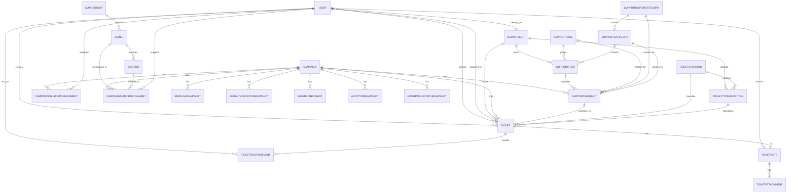
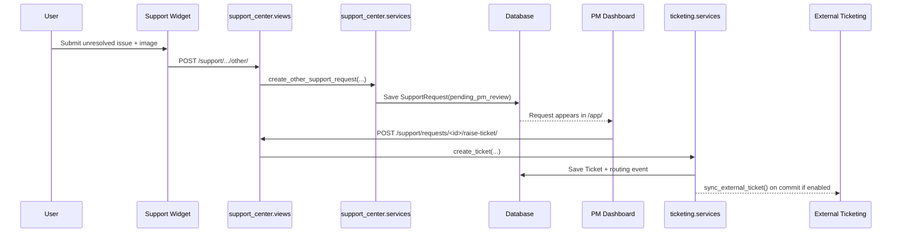
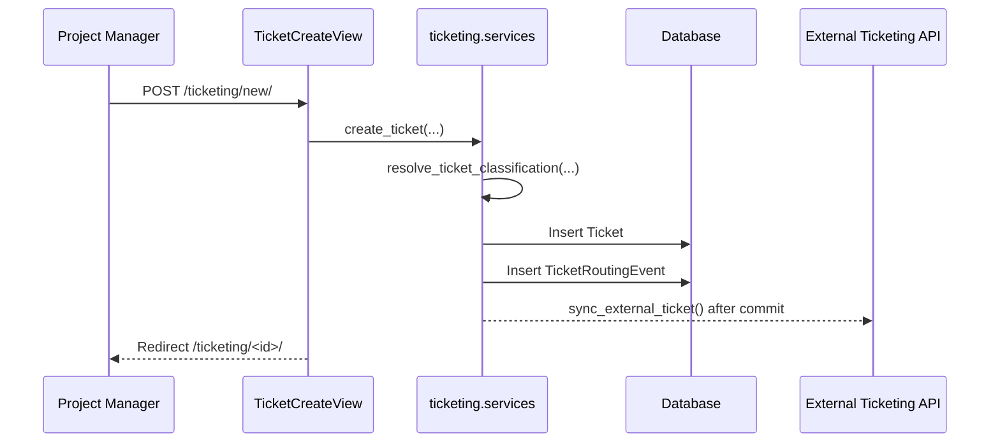
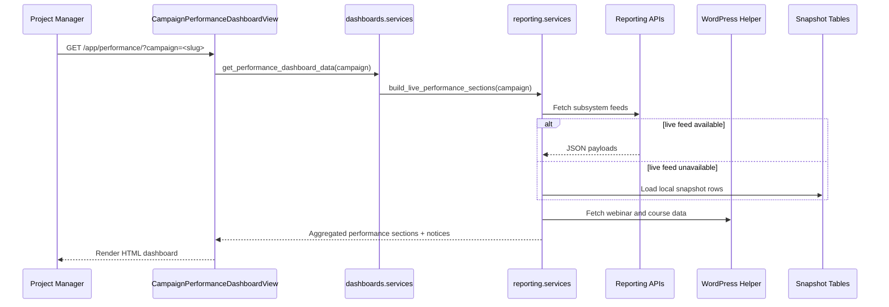

# Unified Campaign Management System

Unified Campaign Management is a Django 4.2 application for operating pharmaceutical and clinic-facing campaigns across three related delivery systems:

1. In-clinic education
2. Red Flag Alert
3. Patient Education

It combines role-specific support experiences, ticket routing, campaign metadata, live reporting aggregation, project-manager dashboards, and optional synchronization into an external internal-ticketing platform. The repository is a server-rendered modular monolith with clearly separated Django apps for accounts, campaigns, support, reporting, dashboards, and ticketing.

## Table of Contents

- [Product Overview](#product-overview)
- [System Architecture](#system-architecture)
- [Codebase Structure](#codebase-structure)
- [Core System Components](#core-system-components)
- [Database Design](#database-design)
- [Feature-Level Documentation](#feature-level-documentation)
- [API and Service Layer](#api-and-service-layer)
- [Application Flow](#application-flow)
- [Developer Onboarding Guide](#developer-onboarding-guide)
- [AI-Optimized System Summary](#ai-optimized-system-summary)

## Product Overview

### What the System Does

The system provides one operational surface for:

1. Campaign setup visibility through campaign, clinic, doctor, and field-rep records
2. Role-based support landing pages for doctors, clinic staff, brand managers, publishers, field reps, and patients
3. Page-wise and combination-wise FAQ delivery through web pages, embeddable widgets, and JSON APIs
4. A guided support assistant that walks users from system selection to FAQ resolution or escalation
5. Ticket creation, routing, delegation, status management, notes, attachments, and optional external sync
6. Project-manager dashboards for support health, campaign performance, and system availability
7. Live and fallback reporting feeds for campaign performance analytics

### Problem It Solves

The codebase addresses a fragmented operational problem: campaign support, content delivery, and performance analytics live across multiple business systems, user roles, and external data feeds. Without a unifying layer, project managers must manually coordinate support issues, campaign enrollments, reporting snapshots, and escalation workflows. This application centralizes those responsibilities and gives each audience an interface that matches its role.

### Key Features

| Feature | Description |
| --- | --- |
| Role-based support hubs | Public support landing pages for `doctor`, `clinic_staff`, `brand_manager`, `publisher`, `field_rep`, and `patient` |
| FAQ page and widget delivery | Support content can be browsed as full pages or embedded as iframe-safe widgets |
| Guided assistant | Session-backed FAQ assistant lets users choose system, flow, category, FAQ, and unresolved issue escalation |
| Ticket lifecycle management | Tickets support automatic classification, department routing, delegation, return-to-sender, notes, attachments, and status updates |
| PM review queue | Unlisted widget issues are stored as `SupportRequest` records for project-manager review before ticket creation |
| Campaign analytics | PM dashboards show ticket summaries, campaign performance metrics, adoption metrics, and live-source health |
| Live reporting integration | Pulls from Red Flag Alert, In-clinic, Patient Education, and WordPress helper feeds with local fallback |
| External ticket synchronization | Local tickets can mirror into the internal ticketing platform and keep attachment sync in step |
| Seed and import automation | Management commands seed demo data, baseline support data, ticket taxonomy, widget links, and PDF-based FAQ imports |

### Target Users

| Audience | How the system serves them |
| --- | --- |
| Doctors | Access support pages, FAQs, widgets, assistant flows, and issue escalation |
| Clinic staff | Access support pages and issue escalation specific to clinic workflows |
| Brand managers | Access support pages plus PM-facing analytics through authenticated dashboards |
| Publishers | Access publisher-facing support pages and FAQ flows for RFA campaign management |
| Field reps | Access support pages tied to campaign activation and sharing issues |
| Patients | Access patient-safe support pages and widget flows |
| Project managers | Use dashboards, campaign views, PM review queue, ticketing workspace, and reporting dashboards |
| Department owners and support agents | Receive routed tickets, update status, add notes, delegate work, and sync to the internal ticketing directory |

### High-Level User Journey

1. A public user enters through `/` or a role-specific support entry point under `/support/<role>/`.
2. The user either browses page-wise FAQs, opens an embedded widget, or uses the guided assistant.
3. If the FAQ resolves the issue, the journey ends in the support experience.
4. If the issue is unresolved, the system creates either:
   - an immediate `Ticket`, or
   - a `SupportRequest` pending project-manager review, depending on the support item and submission path.
5. Project managers monitor `/app/` and `/app/performance/` for ticket health, campaign performance, source availability, and unresolved widget submissions.
6. Routed tickets are worked in `/ticketing/`, optionally mirrored to the external ticketing platform.

## System Architecture

### Overall Architecture

The application is a Django modular monolith. Server-rendered Jinja templates provide the UI, Django ORM provides persistence, service modules contain business rules, and integrations are handled with `requests` plus management commands.



### Core Components

| Component | Role in the system |
| --- | --- |
| `config` | Global settings, URL routing, Jinja environment, environment loading, auth context |
| `apps.accounts` | Custom email-based user model, project-manager role handling, dev login, allauth adapter |
| `apps.campaigns` | Campaign metadata, clinic hierarchy, doctor records, enrollments, and field-rep assignments |
| `apps.support_center` | Public support pages, FAQ APIs, widgets, assistant flow, support requests, PM escalation |
| `apps.ticketing` | Ticket taxonomy, ticket CRUD flows, routing events, notes, attachments, delegation, external sync |
| `apps.reporting` | Reporting payload contracts, live feed adapters, local snapshot fallback, performance aggregation |
| `apps.dashboards` | PM dashboards for support, performance, and system availability |
| `scripts` | Local bootstrap/start and EC2 deployment automation |

### Application Layers

| Layer | Implementation | Notes |
| --- | --- | --- |
| Presentation | Django class-based views plus Jinja templates | HTML-first, no SPA frontend |
| Validation | Django forms in `support_center` and `ticketing` | Validates request payloads and file uploads |
| Domain logic | Service modules under `apps/*/services.py` | Keeps views thin and reusable |
| Persistence | Django models and ORM | SQLite by default, MySQL supported |
| Integration | `requests` calls in reporting and external ticketing services | Supports graceful fallback on live-feed failures |
| Operations | Management commands and deploy scripts | Seed data, import PDFs, export widget links, deploy to EC2 |

### Data Flow

1. A browser request enters through `config.urls`.
2. A view resolves the route and delegates business logic to a service module when needed.
3. The service layer reads or writes models using Django ORM.
4. For live data, service modules call external HTTP endpoints with `requests`.
5. The view returns either:
   - Jinja-rendered HTML, or
   - JSON for support/reporting APIs.
6. Ticket creation can trigger an `on_commit` external sync into the internal ticketing system.

### Component Interaction Diagram



## Codebase Structure

### Folder Structure

```text
.
├── apps/
│   ├── accounts/
│   ├── campaigns/
│   ├── dashboards/
│   ├── reporting/
│   ├── support_center/
│   └── ticketing/
├── config/
├── docs/
├── jinja2/
├── scripts/
├── static/
├── templates/
├── manage.py
├── requirements.txt
├── *.pdf
└── README.md
```

### Purpose of Major Directories and Files

| Path | Purpose |
| --- | --- |
| `manage.py` | Standard Django entry point |
| `config/settings.py` | Environment loading, installed apps, database settings, auth config, integration settings |
| `config/urls.py` | Top-level route map |
| `config/jinja2.py` | Jinja environment exposing `static()` and named `url()` |
| `config/context_processors.py` | Injects Google OAuth availability into templates |
| `apps/accounts/` | Custom user model and authentication helpers |
| `apps/campaigns/` | Campaign, clinic, doctor, and enrollment domain |
| `apps/dashboards/` | PM dashboard views and aggregated dashboard services |
| `apps/reporting/` | Reporting contracts, live-source adapters, and local snapshot access |
| `apps/support_center/` | Support content catalog, widgets, assistant, support request capture, PM escalation |
| `apps/ticketing/` | Ticket model, taxonomy, forms, routing, and external integration |
| `docs/` | Existing docs, widget-link exports, testing notes, extracted reference text |
| `scripts/bootstrap_local.sh` | Convenience local bootstrap script |
| `scripts/start_local.sh` | Convenience local run script |
| `scripts/deploy_ec2.sh` | EC2 deployment and post-deploy data import script |
| `static/support-pdfs/*.pdf` | Bundled FAQ spreadsheets consumed by `import_support_pdfs` and support-link exports |

### Key Modules and Files

| Module | Important files | Why they matter |
| --- | --- | --- |
| Accounts | `models.py`, `views.py`, `adapters.py` | Defines the custom email-only user model and role behavior |
| Campaigns | `models.py`, `views.py`, `management/commands/seed_demo_data.py` | Holds the core campaign domain and demo seed data |
| Support | `models.py`, `views.py`, `services.py`, `forms.py`, `management/commands/import_support_pdfs.py` | Most business workflows start here for public users |
| Ticketing | `models.py`, `forms.py`, `services.py`, `external_ticketing.py` | Responsible for escalation, taxonomy, routing, and mirror sync |
| Reporting | `contracts.py`, `services.py`, `views.py` | Defines payload contracts and live/fallback reporting logic |
| Dashboards | `views.py`, `services.py`, `tests.py` | Aggregates support, reporting, and availability for PM users |

### Dependency Relationships

| Source module | Depends on | Reason |
| --- | --- | --- |
| `accounts` | `ticketing.Department` | Users can belong to departments |
| `campaigns` | `accounts.User` | Field-rep assignments reference users |
| `support_center` | `ticketing`, `campaigns` | Creates tickets and links support requests to campaigns |
| `ticketing` | `accounts`, `campaigns`, optionally `support_center` | Tickets route to users, optionally link back to support requests |
| `dashboards` | `ticketing`, `support_center`, `reporting`, `campaigns` | PM dashboards aggregate across the rest of the system |
| `reporting` | `campaigns` | Filters live and snapshot metrics by campaign |

### Architectural Patterns Used

| Pattern | Where it appears | Why it matters |
| --- | --- | --- |
| Modular monolith | All `apps/*` packages | Clear domain separation without distributed-service overhead |
| Thin views, service-heavy logic | `support_center.services`, `ticketing.services`, `reporting.services`, `dashboards.services` | Business logic is reusable and easier to document/test |
| Metadata-driven support catalog | `SupportPage`, `SupportSuperCategory`, `SupportCategory`, `SupportItem` | Support UI is largely data-configured instead of hard-coded |
| Keyword-based ticket classification | `ticketing.services.resolve_ticket_classification()` | Tickets can be categorized automatically or extended dynamically |
| Graceful live-data fallback | `reporting.services.get_subsystem_payload()` | Dashboards continue to work if live reporting is unavailable |
| On-commit integration sync | `ticketing.services.create_ticket()` | Local ticket creation remains authoritative while sync happens after commit |
| Server-rendered widget delivery | `support_center` widget views | Support can be embedded without a separate frontend build |

## Core System Components

### Controllers and Views

| Area | Main views | Responsibilities |
| --- | --- | --- |
| Home and dashboards | `HomeView`, `ProjectManagementDashboardView`, `CampaignPerformanceDashboardView`, `MyWorkRedirectView` | Public home, PM dashboards, campaign selection, role-aware redirect |
| Accounts | `DevelopmentLoginView`, `AccountHealthView` | Dev login shortcut and lightweight account heartbeat |
| Campaigns | `CampaignListView`, `CampaignDetailView` | Authenticated campaign browsing and drill-down |
| Support center | `SupportLandingView`, `SupportFaqPageView`, `SupportFaqWidgetView`, `SupportAssistantView`, `SupportRequestRaiseTicketView` | Public support entry, FAQ pages, widgets, assistant, PM escalation |
| Ticketing | `TicketListView`, `TicketCreateView`, `TicketDetailView`, `TicketDistributionView` | Ticket workspace, ticket creation, workflow actions, distribution analytics |
| Reporting | `ReportingContractsView`, `reporting_contracts_api`, `subsystem_feed` | Human-readable and JSON reporting contracts plus feed access |

### Services

| Service module | Primary responsibilities |
| --- | --- |
| `apps.support_center.services` | FAQ visibility filtering, page/group aggregation, assistant options, support-request creation, ticket escalation from support |
| `apps.ticketing.services` | Ticket taxonomy seeding, classification, ticket creation, delegation, return, status change, distribution summaries |
| `apps.ticketing.external_ticketing` | Department-directory sync, external ticket creation, attachment sync, payload building, department matching |
| `apps.reporting.services` | Live reporting fetches, local snapshot serialization, campaign alias filtering, adoption metrics, external growth aggregation |
| `apps.dashboards.services` | Support dashboard cards, status breakdowns, quality metrics, external source health, performance section assembly |

### Modules and Models

| Domain | Key models | Responsibilities |
| --- | --- | --- |
| Accounts | `User` | Email-based auth, role system, department membership |
| Campaigns | `Campaign`, `ClinicGroup`, `Clinic`, `Doctor`, `CampaignFieldRepAssignment`, `CampaignClinicEnrollment` | Campaign hierarchy and campaign participation |
| Support | `SupportSuperCategory`, `SupportPage`, `SupportCategory`, `SupportItem`, `SupportRequest` | Support catalog and unresolved issue capture |
| Ticketing | `Department`, `TicketCategory`, `TicketTypeDefinition`, `Ticket`, `TicketRoutingEvent`, `TicketNote`, `TicketAttachment` | Ticket taxonomy, assignment, state changes, collaboration artifacts |
| Reporting | `RedFlagSnapshot`, `PatientEducationSnapshot`, `InClinicSnapshot`, `AdoptionSnapshot`, `ExternalGrowthSnapshot` | Local snapshot store for fallback analytics |

### Forms and Input Validation

| Form | Used by | Validation highlights |
| --- | --- | --- |
| `SupportRequestForm` | Public support landing and support-item detail | Collects requester identity, campaign, subject, and free text |
| `SupportOtherIssueForm` | Widgets and assistant unresolved-issue submissions | Requires phone number, limits uploads to image formats under 8 MB |
| `TicketCreateForm` | PM ticket creation and PM escalation form | Requires category, ticket type or new type, requester phone number, and active department |
| `TicketDelegationForm` | Ticket detail | Limits assignee choices to active users and optionally same department |
| `TicketStatusForm` | Ticket detail | Restricts updates to declared ticket statuses |
| `TicketNoteForm` | Ticket detail | Allows up to 3 files, 5 MB each |

### Utilities and Integration Helpers

| File | Purpose |
| --- | --- |
| `apps/accounts/adapters.py` | Forces email-only sign-up behavior and auto-promotes the configured PM user |
| `config/context_processors.py` | Tells templates whether Google OAuth is available |
| `config/jinja2.py` | Registers `static()` and named URL helpers for Jinja templates |
| `apps/reporting/contracts.py` | Defines the expected reporting payload contract used by the contract view and API |
| `apps/ticketing/external_ticketing.py` | Encapsulates all HTTP calls to the external internal-ticketing platform |

### Middleware and Runtime Behavior

The middleware stack is intentionally small and conventional:

1. `SecurityMiddleware`
2. `WhiteNoiseMiddleware`
3. `SessionMiddleware`
4. `CommonMiddleware`
5. `CsrfViewMiddleware`
6. `AuthenticationMiddleware`
7. `allauth.account.middleware.AccountMiddleware`
8. `MessageMiddleware`
9. `XFrameOptionsMiddleware`

Important runtime details:

1. `USE_X_FORWARDED_HOST = True` and `SECURE_PROXY_SSL_HEADER` are enabled so URLs stay correct behind Nginx on EC2.
2. Widget views are explicitly `xframe_options_exempt` so they can be embedded.
3. Widget unresolved-issue POST endpoints are `csrf_exempt` and accept multipart form data from embedded clients.
4. Static assets are served via WhiteNoise and use manifest storage outside `DEBUG`.

## Database Design

### Database Engine

| Environment | Database |
| --- | --- |
| Local development | SQLite at `db.sqlite3` |
| Production option | MySQL via `DB_ENGINE=mysql` and `DB_*` settings |

### Entities by Domain

#### Accounts

| Entity | Purpose | Important fields |
| --- | --- | --- |
| `User` | Custom auth model for PMs, support agents, department owners, field reps, clinic staff, and doctors | `email`, `full_name`, `role`, `department`, `phone_number`, `company`, `timezone`, `is_staff`, `is_superuser` |

#### Campaigns

| Entity | Purpose | Important fields |
| --- | --- | --- |
| `Campaign` | Master campaign record | `name`, `slug`, `brand_name`, `status`, `geography`, `start_date`, `end_date`, feature flags |
| `ClinicGroup` | Geography/grouping layer for clinics | `name`, `geography` |
| `Clinic` | Clinic directory record | `clinic_group`, `city`, `state`, `clinic_code` |
| `Doctor` | Doctor record associated with a clinic | `clinic`, `specialty`, `email`, onboarding flags |
| `CampaignFieldRepAssignment` | Assigns a field rep to a campaign | `campaign`, `field_rep`, `territory`, `assigned_at` |
| `CampaignClinicEnrollment` | Tracks campaign participation by clinic, doctor, and source system | `campaign`, `clinic`, `doctor`, `field_rep`, `source_system`, `enrolled_on` |

#### Support Catalog and Requests

| Entity | Purpose | Important fields |
| --- | --- | --- |
| `SupportSuperCategory` | Top-level support grouping | `name`, `slug`, `display_order`, `is_active` |
| `SupportPage` | Page-wise support grouping used by landing pages and widgets | `name`, `slug`, `source_system`, `source_flow` |
| `SupportCategory` | Category within a super-category | `super_category`, `name`, `slug`, `display_order` |
| `SupportItem` | FAQ or ticket-case content node | `page`, `category`, `knowledge_type`, `response_mode`, `solution_body`, `ticket_department`, visibility flags |
| `SupportRequest` | Captured user issue, either directly ticketed or queued for PM review | requester fields, campaign, support context, free text, upload, status |

#### Ticketing

| Entity | Purpose | Important fields |
| --- | --- | --- |
| `Department` | Ticket routing target | `name`, `code`, `support_email`, `default_recipient`, external directory fields |
| `TicketCategory` | Top-level taxonomy bucket | `name`, `slug`, `description`, `display_order` |
| `TicketTypeDefinition` | Typed classification under a category | `category`, `name`, `slug`, `default_priority`, `default_department`, `default_source_system` |
| `Ticket` | Core work item | `ticket_number`, `title`, `description`, `status`, `priority`, `department`, assignees, requester identity, external sync fields |
| `TicketRoutingEvent` | Immutable routing/activity history | `ticket`, `action`, `actor`, `from_user`, `to_user`, `description` |
| `TicketNote` | Human-authored collaboration note | `ticket`, `author`, `body`, `created_at` |
| `TicketAttachment` | File attached to a note | `note`, `file`, `created_at` |

#### Reporting Snapshots

| Entity | Purpose | Important fields |
| --- | --- | --- |
| `RedFlagSnapshot` | Local fallback for Red Flag Alert metrics | counts for fills, flags, reports, scans, reminders |
| `PatientEducationSnapshot` | Local fallback for Patient Education metrics | views, completions, shares, scans, banner clicks |
| `InClinicSnapshot` | Local fallback for In-clinic metrics | field rep, doctor, shares, opens, PDF/video activity |
| `AdoptionSnapshot` | Local fallback for adoption metrics | `system_type`, doctors/clinics added, clinics with shares |
| `ExternalGrowthSnapshot` | Local fallback for webinar and certificate completion metrics | webinar attendees and certificate completion counts |

### Key Relationships and Constraints

| Constraint | Location |
| --- | --- |
| `User.email` unique | `accounts.User` |
| `Campaign.slug` unique | `campaigns.Campaign` |
| `ClinicGroup(name, geography)` unique together | `campaigns.ClinicGroup` |
| `Clinic.clinic_code` unique | `campaigns.Clinic` |
| `CampaignFieldRepAssignment(campaign, field_rep)` unique together | `campaigns.CampaignFieldRepAssignment` |
| `SupportSuperCategory.slug` unique | `support_center.SupportSuperCategory` |
| `SupportPage.slug` unique | `support_center.SupportPage` |
| `SupportCategory(super_category, slug)` unique together | `support_center.SupportCategory` |
| `SupportItem(category, slug)` unique together | `support_center.SupportItem` |
| `Department.code`, `Department.support_email`, and `Department.external_directory_id` unique | `ticketing.Department` |
| `Ticket.ticket_number` unique | `ticketing.Ticket` |
| `Ticket.support_request` optional one-to-one | `ticketing.Ticket` to `support_center.SupportRequest` |
| `TicketCategory.slug` unique | `ticketing.TicketCategory` |
| `TicketTypeDefinition(category, slug)` unique together | `ticketing.TicketTypeDefinition` |

### ER Diagram



## Feature-Level Documentation

### 1. Role-Based Support Landing Pages

**Purpose**  
Provide public, audience-specific support entry points for doctors, clinic staff, brand managers, field reps, and patients.

**User flow**

1. The user opens `/support/<user_type>/`.
2. The landing page shows page-wise FAQ blocks generated from `SupportPage` and visible `SupportItem` records.
3. The page also exposes a free-text support form and a link to the FAQ links API.

**Backend logic**

1. `SupportLandingView` loads visible FAQ pages using `get_faq_page_overview(user_type)`.
2. `submit_support_request()` decides whether the free-text submission creates a ticket immediately or stores only a support request.

**Data interactions**  
Reads `SupportPage`, `SupportItem`, `SupportCategory`, and optionally creates `SupportRequest` and `Ticket`.

**Components involved**  
`apps/support_center/views.py`, `apps/support_center/services.py`, `apps/support_center/forms.py`, `apps/ticketing/services.py`

### 2. FAQ Pages, Widgets, and Embeddable Support APIs

**Purpose**  
Expose support content both as human-readable pages and as iframe-safe widgets for embedding in other systems.

**User flow**

1. A user opens a page-wise FAQ view or embedded widget.
2. The UI fetches or receives a page payload describing sections, FAQs, and other-issue endpoints.
3. If the FAQ does not solve the problem, the user submits an unresolved issue directly from the widget.

**Backend logic**

1. `_build_page_payload()` and `_build_combination_payload()` produce normalized JSON structures.
2. Widget views are `xframe_options_exempt`.
3. Support JSON endpoints return permissive CORS headers through `_cors_json()`.
4. Unresolved widget issue endpoints are CSRF-exempt and store `SupportRequest` records with explicit system/flow context.

**Data interactions**  
Reads `SupportPage`, `SupportCategory`, `SupportItem`; writes `SupportRequest`.

**Components involved**  
`apps/support_center/views.py`, `apps/support_center/services.py`, `docs/support-widget-integration.md`, `apps/support_center/management/commands/export_support_widget_links.py`

### 3. Guided Support Assistant

**Purpose**  
Offer a step-by-step support experience that narrows by system, flow, category, FAQ, and unresolved issue.

**User flow**

1. The user opens `/support/<role>/assistant/`.
2. The assistant asks for system, then flow, then category.
3. The user views FAQ answers or chooses `Other`.
4. An unresolved issue is saved for PM review with the assistant context.

**Backend logic**

1. `SupportAssistantView` stores progress in the session key `support-assistant:<user_type>`.
2. `get_available_systems()`, `get_available_flows()`, and `get_available_categories()` drive the assistant menu.
3. `create_other_support_request()` persists unresolved issues without creating a ticket immediately.

**Data interactions**  
Reads visible support catalog records and writes `SupportRequest`.

**Components involved**  
`apps/support_center/views.py`, `apps/support_center/services.py`, `apps/support_center/forms.py`

### 4. Ticketing Workspace and Routing

**Purpose**  
Provide the authenticated work queue for support agents and project managers.

**User flow**

1. PMs or department users open `/ticketing/`.
2. They filter, sort, or search tickets.
3. From the detail page they change status, delegate, return, add notes, and upload attachments.
4. PMs can also create tickets manually from `/ticketing/new/`.

**Backend logic**

1. `_scoped_ticket_queryset()` restricts non-PM users to tickets they are involved with.
2. `create_ticket()` resolves taxonomy, creates the ticket, writes an initial routing event, and schedules external sync.
3. `delegate_ticket()`, `return_ticket_to_sender()`, and `change_ticket_status()` record immutable `TicketRoutingEvent` entries.

**Data interactions**  
Reads and writes `Ticket`, `TicketCategory`, `TicketTypeDefinition`, `TicketRoutingEvent`, `TicketNote`, `TicketAttachment`, `Department`, `User`.

**Components involved**  
`apps/ticketing/views.py`, `apps/ticketing/forms.py`, `apps/ticketing/services.py`, `apps/ticketing/models.py`

### 5. PM Review of Unlisted Support Issues

**Purpose**  
Turn unresolved widget or assistant submissions into a project-manager review queue before formal ticket creation.

**User flow**

1. A user submits `Other issue` from a widget or assistant.
2. The request is stored with `status = pending_pm_review`.
3. PM sees the request on `/app/`.
4. PM opens `/support/requests/<id>/raise-ticket/`.
5. PM confirms or edits classification and creates the real ticket.

**Backend logic**

1. `create_other_support_request()` stores the unresolved issue and context.
2. `build_support_request_ticket_initial()` pre-populates the PM ticket form using the request metadata.
3. `SupportRequestRaiseTicketView` attaches the original uploaded image to the created ticket as a note attachment.

**Data interactions**  
Reads `SupportRequest`; writes `Ticket`, `TicketNote`, `TicketAttachment`.

**Components involved**  
`apps/support_center/views.py`, `apps/support_center/services.py`, `apps/ticketing/forms.py`, `apps/ticketing/services.py`

### 6. Campaign Performance and PM Dashboards

**Purpose**  
Give project managers a single page for support health, campaign metrics, pending support issues, and system availability.

**User flow**

1. PM logs in and opens `/app/` or `/app/performance/`.
2. The dashboard optionally filters by campaign slug in the query string.
3. The page shows support KPIs, ticket charts, reporting metrics, adoption stats, external growth metrics, and URL health checks.

**Backend logic**

1. `get_support_dashboard_data()` aggregates ticket counts, status/priority/category charts, ageing, resolution quality, and PM review items.
2. `get_performance_dashboard_data()` delegates to `build_live_performance_sections()`.
3. `get_system_status_dashboard_data()` probes internal and external URLs and groups them by severity.

**Data interactions**  
Reads `Ticket`, `SupportRequest`, `Campaign`, and reporting snapshots; optionally calls live external APIs.

**Components involved**  
`apps/dashboards/views.py`, `apps/dashboards/services.py`, `apps/reporting/services.py`

### 7. Reporting Feed Aggregation

**Purpose**  
Normalize live reporting feeds and local snapshot data into a single contract consumed by dashboards and downstream systems.

**User flow**

1. A dashboard or client requests `/reporting/api/<subsystem>/`.
2. The system uses live APIs if enabled.
3. If a live endpoint fails or campaign identifiers do not match, the system falls back gracefully to local snapshot data.

**Backend logic**

1. `get_subsystem_payload()` branches between live fetch and local snapshot serialization.
2. `_filter_live_results()` maps external campaign identifiers to local campaign aliases.
3. `build_live_performance_sections()` merges reporting subsystems with WordPress webinar/course metrics.

**Data interactions**  
Reads reporting snapshot tables and calls live reporting plus WordPress helper APIs.

**Components involved**  
`apps/reporting/services.py`, `apps/reporting/contracts.py`, `apps/reporting/views.py`

### 8. External Ticketing Synchronization

**Purpose**  
Mirror local tickets into the internal ticketing platform and keep department routing aligned with the external directory.

**User flow**

1. PM or support workflow creates a local ticket.
2. If sync is enabled, the ticket is queued for on-commit external creation.
3. Notes with attachments can sync attachment updates into the external ticket.
4. A management command can refresh department-manager mappings manually.

**Backend logic**

1. `sync_external_directory()` fetches department and system-directory lookups and upserts local `Department` records plus manager users.
2. `sync_external_ticket()` creates or reuses an external ticket by reference.
3. `sync_external_ticket_attachments()` mirrors later note attachments.
4. Fuzzy department matching bridges local and external naming differences.

**Data interactions**  
Reads and writes `Department`, `User`, `Ticket`, `TicketAttachment`; calls external ticketing endpoints.

**Components involved**  
`apps/ticketing/external_ticketing.py`, `apps/ticketing/management/commands/sync_internal_ticket_directory.py`

### 9. Campaign Directory and Enrollment Tracking

**Purpose**  
Model the campaign hierarchy needed by reporting, dashboard filters, and support context.

**User flow**

1. Authenticated users browse `/campaigns/` and `/campaigns/<slug>/`.
2. PM dashboards and support tickets attach to campaigns.
3. Reporting feeds can be filtered by the selected campaign.

**Backend logic**

1. `CampaignListView` annotates enrolled clinics and assigned field reps.
2. `CampaignDetailView` prefetches field-rep assignments and clinic enrollments.

**Data interactions**  
Reads `Campaign`, `CampaignFieldRepAssignment`, `CampaignClinicEnrollment`, `Clinic`, `Doctor`, `User`.

**Components involved**  
`apps/campaigns/models.py`, `apps/campaigns/views.py`

## API and Service Layer

### HTTP Interface Overview

The repository exposes two kinds of HTTP interfaces:

1. Server-rendered HTML endpoints for users and project managers
2. JSON endpoints for support widgets and reporting feeds

### HTML Endpoints

| Path | Methods | Auth | Purpose | Inputs | Response |
| --- | --- | --- | --- | --- | --- |
| `/` | `GET` | Public | Public home page with campaign list | None | HTML |
| `/accounts/dev-login/` | `GET` | Public when enabled | Local PM sign-in shortcut | None | Redirect to `/app/` |
| `/accounts/health/` | `GET` | Login required | Updates `last_seen_at` and returns user to PM dashboard | None | Redirect |
| `/app/` | `GET` | PM or superuser | Project-management dashboard | Optional `campaign=<slug>` | HTML |
| `/app/performance/` | `GET` | PM or superuser | Campaign performance dashboard | Optional `campaign=<slug>` | HTML |
| `/app/my-work/` | `GET` | Login required | Redirects PMs to `/app/` and others to `/ticketing/` | None | Redirect |
| `/campaigns/` | `GET` | Login required | Campaign list with annotations | None | HTML |
| `/campaigns/<slug>/` | `GET` | Login required | Campaign detail | Campaign slug | HTML |
| `/ticketing/` | `GET` | Login required | Ticket list | Query, status, priority, category, type, campaign, period, scope, sort | HTML |
| `/ticketing/distribution/` | `GET` | Login required | Ticket distribution dashboard | Category, type, source system, period | HTML |
| `/ticketing/new/` | `GET`, `POST` | Login required | Create ticket manually | `TicketCreateForm` fields | Form page or redirect to detail |
| `/ticketing/<int:pk>/` | `GET`, `POST` | Login required and ticket-visible | View ticket and perform workflow actions | `action=status|delegate|return|note` plus subform fields | HTML or redirect |
| `/support/<user_type>/` | `GET`, `POST` | Public | Role-specific support landing page and free-text support submission | `SupportRequestForm` fields | HTML or redirect to success |
| `/support/<user_type>/faq/page/<page_slug>/` | `GET` | Public | Full page-wise FAQ page | Page slug and optional `system` or `flow` query params | HTML |
| `/support/<user_type>/faq/<super_slug>/` | `GET` | Public | Super-category page showing category cards | Super-category slug | HTML |
| `/support/<user_type>/faq/page/<page_slug>/widget/` | `GET` | Public | Page-wise support widget; iframe-safe when `embed=1` | Page slug and optional context query params | HTML |
| `/support/<user_type>/faq/<super_slug>/<category_slug>/widget/` | `GET` | Public | Combination-wise support widget; iframe-safe when `embed=1` | Super/category slugs and optional context | HTML |
| `/support/<user_type>/assistant/` | `GET`, `POST` | Public | Guided support assistant | Session-backed step forms and unresolved issue form | HTML or redirect |
| `/support/<user_type>/<super_slug>/<category_slug>/<item_slug>/` | `GET`, `POST` | Public | Item detail page and direct support-item escalation | `SupportRequestForm` fields | HTML or redirect |
| `/support/<user_type>/request/<int:request_id>/success/` | `GET` | Public | Confirmation page after support submission | Request ID | HTML |
| `/support/requests/<int:request_id>/raise-ticket/` | `GET`, `POST` | PM or superuser | Convert PM-reviewed support issue into a ticket | `TicketCreateForm` fields | HTML or redirect |
| `/reporting/contracts/` | `GET` | Login required | Human-readable reporting contract view | None | HTML |

Additional authentication routes are mounted through `django-allauth` under `/accounts/`, including login, logout, and Google social-auth flows.

### JSON Endpoints

| Path | Methods | Auth | Purpose | Request | Response |
| --- | --- | --- | --- | --- | --- |
| `/support/api/<user_type>/faq-links/` | `GET`, `OPTIONS` | Public | Returns all page-wise support links for a role | Optional context is inferred from each page | JSON with `count` and `results[]` |
| `/support/api/<user_type>/pages/<page_slug>/` | `GET`, `OPTIONS` | Public | Returns page-wise support payload | Optional `system` and `flow` query params | JSON with page metadata, sections, FAQ list, URLs |
| `/support/api/<user_type>/<super_slug>/<category_slug>/` | `GET`, `OPTIONS` | Public | Returns specific super-category/category FAQ payload | Optional `system` and `flow` query params | JSON with super-category, category, FAQs, URLs |
| `/support/<user_type>/faq/page/<page_slug>/other/` | `POST` | Public | Creates PM-review `SupportRequest` from a page widget | Multipart form: requester info, issue text, upload, optional `selected_faq_id`, `selected_section_slug`, context values | JSON `{ success, request_id, message }` |
| `/support/<user_type>/faq/<super_slug>/<category_slug>/other/` | `POST` | Public | Creates PM-review `SupportRequest` from a combination widget | Multipart form: requester info, issue text, upload, optional `selected_faq_id`, context values | JSON `{ success, request_id, message }` |
| `/reporting/api/contracts/` | `GET` | Public | Returns reporting contract definitions | None | JSON contract map |
| `/reporting/api/<subsystem>/` | `GET` | Public | Returns reporting payload for `red_flag_alert`, `in_clinic`, `patient_education`, `adoption`, or `external_growth` | Optional `campaign=<slug>` | JSON payload with `results`, `source`, `count`, `notices` |

### Important Request and Response Shapes

#### `SupportRequestForm`

Used by landing pages and support-item detail pages.

| Field | Type |
| --- | --- |
| `requester_name` | string |
| `requester_email` | email |
| `requester_company` | string |
| `campaign` | optional campaign id |
| `subject` | string |
| `free_text` | multiline text |

#### `SupportOtherIssueForm`

Used by widgets and assistant unresolved-issue submissions.

| Field | Type | Notes |
| --- | --- | --- |
| `requester_name` | string | Required |
| `requester_number` | string | Required |
| `requester_email` | email | Required |
| `free_text` | multiline text | Required |
| `uploaded_file` | image upload | Optional, max 8 MB, image formats only |

#### `TicketCreateForm`

| Field | Type | Notes |
| --- | --- | --- |
| `title` | string | Required |
| `description` | text | Required |
| `ticket_category` | foreign key | Required |
| `ticket_type_definition` | foreign key | Optional if `new_ticket_type_name` supplied |
| `new_ticket_type_name` | string | Lets PM create a taxonomy extension inline |
| `user_type` | enum | Defaults to `internal` for PM-created tickets |
| `source_system` | enum | Defaults to `project_manager` |
| `priority` | enum | Defaults to `medium` |
| `status` | enum | Defaults to `not_started` |
| `department` | foreign key | Required and must have a default recipient |
| `campaign` | optional foreign key | Optional |
| `requester_name` | string | Required |
| `requester_email` | email | Required |
| `requester_number` | string | Required for external sync |
| `requester_company` | string | Optional |

#### Ticket detail POST actions

| `action` value | Expected fields | Effect |
| --- | --- | --- |
| `status` | `status` | Changes ticket status and logs a routing event |
| `delegate` | `assignee` | Delegates current assignee and logs event |
| `return` | none | Returns ticket to `created_by` and logs event |
| `note` | `body`, `attachments[]` | Adds note and optional attachments |

### Service Entry Points

| Function | Module | Purpose |
| --- | --- | --- |
| `submit_support_request()` | `apps.support_center.services` | Converts a support submission into a `SupportRequest` and, when applicable, an immediate ticket |
| `create_other_support_request()` | `apps.support_center.services` | Stores unresolved assistant/widget issue for PM review |
| `build_support_request_ticket_initial()` | `apps.support_center.services` | Pre-populates the PM escalation form from a `SupportRequest` |
| `create_ticket()` | `apps.ticketing.services` | Classifies, creates, and optionally queues external sync for a ticket |
| `resolve_ticket_classification()` | `apps.ticketing.services` | Applies taxonomy rules or creates dynamic ticket types |
| `build_ticket_distribution_data()` | `apps.ticketing.services` | Builds dashboard-ready volume-by-day series |
| `sync_external_directory()` | `apps.ticketing.external_ticketing` | Pulls department and manager mappings from the external platform |
| `sync_external_ticket()` | `apps.ticketing.external_ticketing` | Mirrors a local ticket into the external platform |
| `get_subsystem_payload()` | `apps.reporting.services` | Returns live or local reporting data by subsystem |
| `build_live_performance_sections()` | `apps.reporting.services` | Produces the PM performance dashboard payload |
| `get_support_dashboard_data()` | `apps.dashboards.services` | Aggregates support and ticket metrics for `/app/` |
| `get_system_status_dashboard_data()` | `apps.dashboards.services` | Probes internal and external URLs for availability |

### External Integrations

| Integration | Consumed by | Endpoint families |
| --- | --- | --- |
| Internal ticketing platform | `apps.ticketing.external_ticketing` | `/client-tickets/api/lookups/system-directory/`, `/lookups/departments/`, `/lookups/ticket-types/`, `/tickets/`, `/tickets/by-external-reference/`, `/tickets/<ticket_number>/inditech-update/` |
| Live reporting feeds | `apps.reporting.services` | `REPORTING_API_RED_FLAG_ALERT_URL`, `REPORTING_API_IN_CLINIC_URL`, `REPORTING_API_PATIENT_EDUCATION_URL` |
| WordPress helper | `apps.reporting.services` | `WORDPRESS_HELPER_URL` with `ld_api=webinar_registrations` and `ld_api=course_breakdown` |

## Application Flow

### Flow 1: FAQ Widget to PM-Reviewed Ticket

1. A user opens an embedded support widget.
2. The widget payload comes from `/support/api/<role>/pages/<page_slug>/` or `/support/api/<role>/<super>/<category>/`.
3. If the FAQ does not solve the problem, the widget posts to an `other/` endpoint.
4. The app stores a `SupportRequest` with `status = pending_pm_review`.
5. The PM sees it on `/app/`, opens the raise-ticket screen, and creates the actual `Ticket`.
6. The uploaded image becomes a `TicketAttachment`.



### Flow 2: PM Manual Ticket Creation

1. PM opens `/ticketing/new/`.
2. The form loads active departments, ticket categories, and type definitions.
3. `create_ticket()` resolves taxonomy from either:
   - explicit category/type selection,
   - a new type name, or
   - keyword inference.
4. The saved ticket gets an auto-generated ticket number and an initial routing event.
5. If external sync is enabled, the system mirrors the ticket after the database transaction commits.



### Flow 3: Performance Dashboard with Live Fallback

1. PM opens `/app/performance/`.
2. `build_live_performance_sections()` requests live reporting payloads for all three subsystems.
3. If a live request fails or cannot map the selected campaign identifier, the system falls back to local snapshot tables and adds a notice.
4. WordPress webinar and course-completion data is combined into external growth metrics.



## Developer Onboarding Guide

### Tech Stack and Required Tools

| Tool | Version or role |
| --- | --- |
| Python | 3.9+ |
| Django | 4.2.29 |
| Database | SQLite by default, MySQL optional |
| Auth | `django-allauth` with Google provider and a dev-login fallback |
| Templating | Jinja2 plus Django templates for auth pages |
| HTTP integrations | `requests` |
| PDF parsing | `pdfplumber`, `pypdf` |

### Environment Setup

The app loads environment variables in this order:

1. Repository-root `.env`
2. `SECRETS_ENV_PATH` if present, defaulting to `/var/www/secrets/.env`

Recommended local setup:

```bash
git clone https://github.com/gopalakrishnanplus-creator/unified_campaign_management.git
cd unified_campaign_management

python3 -m venv .venv
source .venv/bin/activate
pip install --upgrade pip
pip install -r requirements.txt
```

Create or review `.env` before running commands. A safe minimal local example is:

```env
DJANGO_SECRET_KEY=change-me
DEBUG=true
TIME_ZONE=Asia/Kolkata
PROJECT_MANAGER_EMAIL=campaignpm@inditech.co.in
PROJECT_MANAGER_EMAILS=campaignpm@inditech.co.in,pm2@inditech.co.in,pm3@inditech.co.in
ENABLE_DEV_LOGIN=true

DB_ENGINE=sqlite

GOOGLE_CLIENT_ID=
GOOGLE_CLIENT_SECRET=

EXTERNAL_TICKETING_SYNC_ENABLED=false
EXTERNAL_TICKETING_BASE_URL=https://support.inditech.co.in
EXTERNAL_TICKETING_API_TOKEN=
EXTERNAL_TICKETING_REQUESTER_PHONE_FALLBACK=

REPORTING_API_USE_LIVE=false
REPORTING_API_RED_FLAG_ALERT_URL=https://reports.inditech.co.in/reporting/api/red_flag_alert/
REPORTING_API_IN_CLINIC_URL=https://reports.inditech.co.in/reporting/api/in_clinic/
REPORTING_API_PATIENT_EDUCATION_URL=https://reports.inditech.co.in/reporting/api/patient_education/

WORDPRESS_HELPER_URL=https://esapa.one/
WORDPRESS_HELPER_SECRET=
WORDPRESS_GROWTH_WEBINAR_FILTERS=SAPA Growth Clinics
WORDPRESS_CERTIFICATE_COURSE_IDS=8693,9204
```

### Environment Variables

| Variable | Required | Default or behavior |
| --- | --- | --- |
| `DJANGO_SECRET_KEY` | Production yes | Defaults to a local development key |
| `DEBUG` | No | `true` by default |
| `TIME_ZONE` | No | `Asia/Kolkata` |
| `PROJECT_MANAGER_EMAIL` | No | `campaignpm@inditech.co.in` |
| `PROJECT_MANAGER_EMAILS` | No | Optional comma-separated allowlist for additional PM Google accounts |
| `ENABLE_DEV_LOGIN` | No | `true` |
| `DB_ENGINE` | No | `sqlite`; set to `mysql` for MySQL |
| `DB_NAME`, `DB_USER`, `DB_PASSWORD`, `DB_HOST`, `DB_PORT` | MySQL only | Used only when `DB_ENGINE=mysql` |
| `GOOGLE_CLIENT_ID`, `GOOGLE_CLIENT_SECRET` | Only for real Google OAuth | If absent, templates can hide Google OAuth affordances |
| `EXTERNAL_TICKETING_SYNC_ENABLED` | No | `false` in `DEBUG`, `true` otherwise |
| `EXTERNAL_TICKETING_BASE_URL` | If sync enabled | Base URL for the internal ticketing platform |
| `EXTERNAL_TICKETING_API_TOKEN` | Usually yes if sync enabled | Added as `X-Client-Ticket-Token` |
| `EXTERNAL_TICKETING_SOURCE_SYSTEM` | No | `campaign_management` |
| `EXTERNAL_TICKETING_TIMEOUT` | No | `10` seconds |
| `EXTERNAL_TICKETING_REQUESTER_PHONE_FALLBACK` | Optional | Used when requester phone cannot be resolved |
| `REPORTING_API_USE_LIVE` | No | `true` |
| `REPORTING_API_TIMEOUT` | No | `5` seconds |
| `REPORTING_API_RED_FLAG_ALERT_URL` | If live reporting enabled | Live Red Flag Alert endpoint |
| `REPORTING_API_IN_CLINIC_URL` | If live reporting enabled | Live In-clinic endpoint |
| `REPORTING_API_PATIENT_EDUCATION_URL` | If live reporting enabled | Live Patient Education endpoint |
| `WORDPRESS_HELPER_URL` | For external growth metrics | Defaults to `https://esapa.one/` |
| `WORDPRESS_HELPER_SECRET` | For external growth metrics | Used in helper API calls |
| `WORDPRESS_HELPER_TIMEOUT` | No | `20` seconds |
| `WORDPRESS_GROWTH_WEBINAR_FILTERS` | No | `SAPA Growth Clinics` |
| `WORDPRESS_CERTIFICATE_COURSE_IDS` | No | `8693,9204` |
| `STATUS_MONITOR_EXTRA_TARGETS_JSON` | Optional | JSON list of extra URL health-check targets |
| `SECRETS_ENV_PATH` | Optional | Defaults to `/var/www/secrets/.env` |

### Installation and First Run

Canonical manual setup:

```bash
source .venv/bin/activate
python manage.py migrate
python manage.py seed_demo_data
python manage.py runserver 127.0.0.1:8000
```

Convenience scripts:

```bash
bash scripts/bootstrap_local.sh
bash scripts/start_local.sh
```

The manual steps above are the source of truth. The bootstrap script is a convenience wrapper around virtualenv setup, dependency installation, migrations, and demo seeding.

### Useful Management Commands

| Command | Purpose |
| --- | --- |
| `python manage.py seed_demo_data` | Seeds campaigns, users, departments, support catalog, tickets, and reporting snapshots |
| `python manage.py seed_support_baseline` | Seeds a small baseline support catalog for widget links |
| `python manage.py seed_ticketing_dropdowns` | Seeds departments, campaigns, ticket categories, and ticket types for the ticket form |
| `python manage.py import_support_pdfs --replace <pdf...>` | Imports FAQ and ticket-case rows from the bundled PDF sheets |
| `python manage.py export_support_widget_links --base-url <url>` | Exports page-wise widget/API link catalogs to `docs/` |
| `python manage.py sync_internal_ticket_directory` | Pulls department and manager mappings from the internal ticketing API |

### Support PDF Import Workflow

The support catalog can be generated from the bundled PDF spreadsheets in `static/support-pdfs/`.

Example:

```bash
python manage.py import_support_pdfs --replace \
  static/support-pdfs/in-clinic-flow1-doctor-faqs.pdf \
  static/support-pdfs/in-clinic-flow2-field-rep-faqs.pdf \
  static/support-pdfs/patient-education-flow1-doctor-faqs.pdf \
  static/support-pdfs/patient-education-flow2-patient-faqs.pdf \
  static/support-pdfs/red-flag-alert-flow1-doctor-faqs.pdf \
  static/support-pdfs/red-flag-alert-flow2-field-rep-faqs.pdf \
  static/support-pdfs/red-flag-alert-flow3-patient-faqs.pdf \
  static/support-pdfs/red-flag-alert-flow4-publisher-faqs.pdf \
  static/support-pdfs/red-flag-alert-flow5-brand-manager-faqs.pdf
```

The importer:

1. Parses each PDF page with `pdfplumber`
2. Infers source system, flow, audience, and knowledge type from the page title
3. Creates or updates support pages, categories, and items
4. Assigns default departments and audience-visibility flags

### Running the Project

#### Development mode

```bash
source .venv/bin/activate
python manage.py runserver 127.0.0.1:8000
```

Recommended URLs after startup:

| URL | Purpose |
| --- | --- |
| `http://127.0.0.1:8000/` | Public home |
| `http://127.0.0.1:8000/accounts/dev-login/` | Local PM login shortcut |
| `http://127.0.0.1:8000/app/` | PM dashboard |
| `http://127.0.0.1:8000/ticketing/` | Ticket workspace |
| `http://127.0.0.1:8000/reporting/contracts/` | Reporting contract page |

#### Production-style steps

There is no separate frontend build. Production preparation is primarily:

```bash
source .venv/bin/activate
python manage.py migrate
python manage.py check
python manage.py collectstatic --noinput
```

If external ticketing is enabled, run:

```bash
python manage.py sync_internal_ticket_directory
```

### Testing

Run the project checks and automated tests with:

```bash
source .venv/bin/activate
python manage.py check
python manage.py test
```

Current test coverage is concentrated in `apps/dashboards/tests.py`, which exercises:

1. Public and authenticated page rendering
2. Dev login
3. Ticket creation and workflow actions
4. Widget and assistant issue submissions
5. PM escalation from support requests
6. Live reporting fallbacks
7. External ticket-sync behavior
8. Seed commands

The other app-level `tests.py` files are placeholders.

### Deployment

Deployment is implemented through:

1. GitHub Actions workflow: `.github/workflows/deploy.yml`
2. EC2 deployment script: `scripts/deploy_ec2.sh`

The deployment flow:

1. Triggers on push to `main` or manual dispatch
2. Copies the repository to EC2
3. Syncs into `/var/www/unified_campaign_management`
4. Ensures a shared virtualenv at `/var/www/venv`
5. Runs migrations, `manage.py check`, `seed_support_baseline`, PDF import, widget-link validation, and `collectstatic`
6. Optionally runs `sync_internal_ticket_directory`
7. Restarts `campaign_management.service` and `nginx`

## AI-Optimized System Summary

### Fast Summary

| Topic | Summary |
| --- | --- |
| Architecture | Django modular monolith with server-rendered Jinja UI and service-layer business logic |
| Primary apps | `accounts`, `campaigns`, `support_center`, `ticketing`, `reporting`, `dashboards` |
| Main persistence | SQLite locally, MySQL optionally in production |
| Core workflow | Support discovery -> support request or direct ticket -> PM dashboard -> ticket execution -> external sync |
| External dependencies | Internal ticketing API, three reporting APIs, WordPress helper API |
| Important patterns | Metadata-driven support catalog, keyword-driven ticket classification, live-data fallback |

### Core Modules

| Module | What an AI agent should assume |
| --- | --- |
| `apps/support_center` | Public-facing support experience and first stop for user issue capture |
| `apps/ticketing` | Canonical ticket lifecycle logic; `create_ticket()` is the key write path |
| `apps/reporting` | Canonical performance-data adapter; live data can fail and fall back locally |
| `apps/dashboards` | Aggregation layer for PM dashboards; often the best place to understand cross-module behavior |
| `apps/campaigns` | Campaign and enrollment metadata used by dashboards and support context |
| `apps/accounts` | Custom auth model; PM role is email-aware and can be auto-created |

### Key Services

| Service | Use it when you need to understand |
| --- | --- |
| `submit_support_request()` | How support forms become tickets |
| `create_other_support_request()` | How unresolved widget or assistant issues enter PM review |
| `create_ticket()` | How tickets are classified, created, and externally synced |
| `resolve_ticket_classification()` | How categories and ticket types are inferred |
| `build_live_performance_sections()` | How dashboard performance sections are built |
| `get_subsystem_payload()` | How reporting APIs switch between live and local data |
| `get_support_dashboard_data()` | How PM dashboard support cards and charts are computed |

### Data Model Cheat Sheet

| Area | Anchor models |
| --- | --- |
| Users and auth | `User`, `Department` |
| Campaign structure | `Campaign`, `ClinicGroup`, `Clinic`, `Doctor` |
| Support catalog | `SupportPage`, `SupportSuperCategory`, `SupportCategory`, `SupportItem` |
| User issue capture | `SupportRequest` |
| Ticket workflow | `Ticket`, `TicketCategory`, `TicketTypeDefinition`, `TicketRoutingEvent`, `TicketNote`, `TicketAttachment` |
| Reporting | `RedFlagSnapshot`, `PatientEducationSnapshot`, `InClinicSnapshot`, `AdoptionSnapshot`, `ExternalGrowthSnapshot` |

### Main Flows for AI Agents

1. If the task is about public support UX, start in `apps/support_center/views.py` and `apps/support_center/services.py`.
2. If the task is about escalation or routing, start in `apps/ticketing/services.py` and `apps/ticketing/external_ticketing.py`.
3. If the task is about PM dashboards, inspect `apps/dashboards/services.py` first.
4. If the task is about performance numbers or source mismatches, inspect `apps/reporting/services.py`.
5. If the task is about campaign metadata or dashboard filters, inspect `apps/campaigns/models.py`.

### Recommended Read Order for New Contributors or Agents

1. `config/settings.py`
2. `config/urls.py`
3. `apps/support_center/models.py`
4. `apps/support_center/services.py`
5. `apps/ticketing/models.py`
6. `apps/ticketing/services.py`
7. `apps/ticketing/external_ticketing.py`
8. `apps/dashboards/services.py`
9. `apps/reporting/services.py`
10. `apps/campaigns/models.py`

### Operational Caveats

1. Support widget APIs are intentionally open and CORS-enabled.
2. PM dashboards are protected, but reporting JSON feeds are public.
3. The test suite is real and useful, but most of it lives in one file.
4. Ticketing sync depends heavily on external department mapping and requester phone resolution.
5. Live reporting can return unmapped external campaign identifiers; the code falls back gracefully instead of failing hard.
