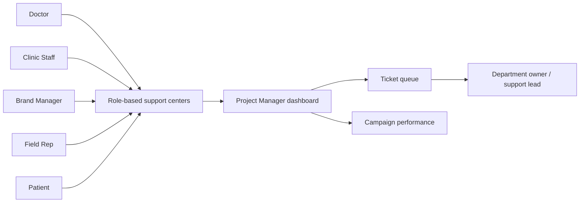
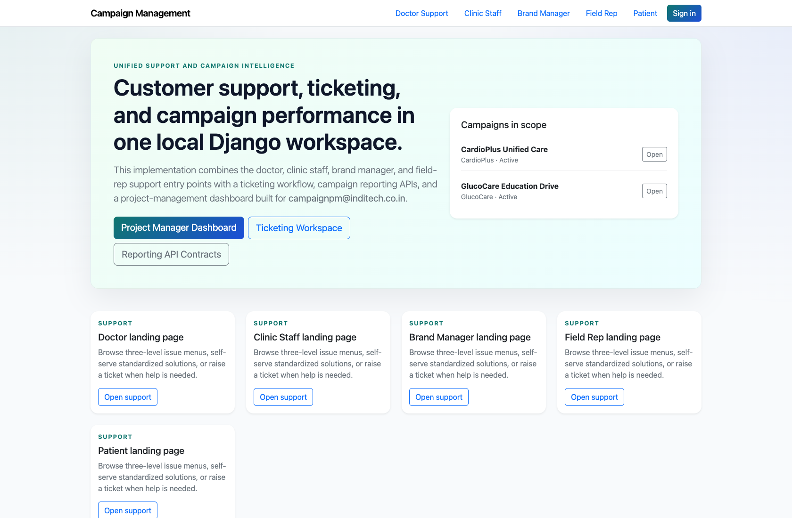
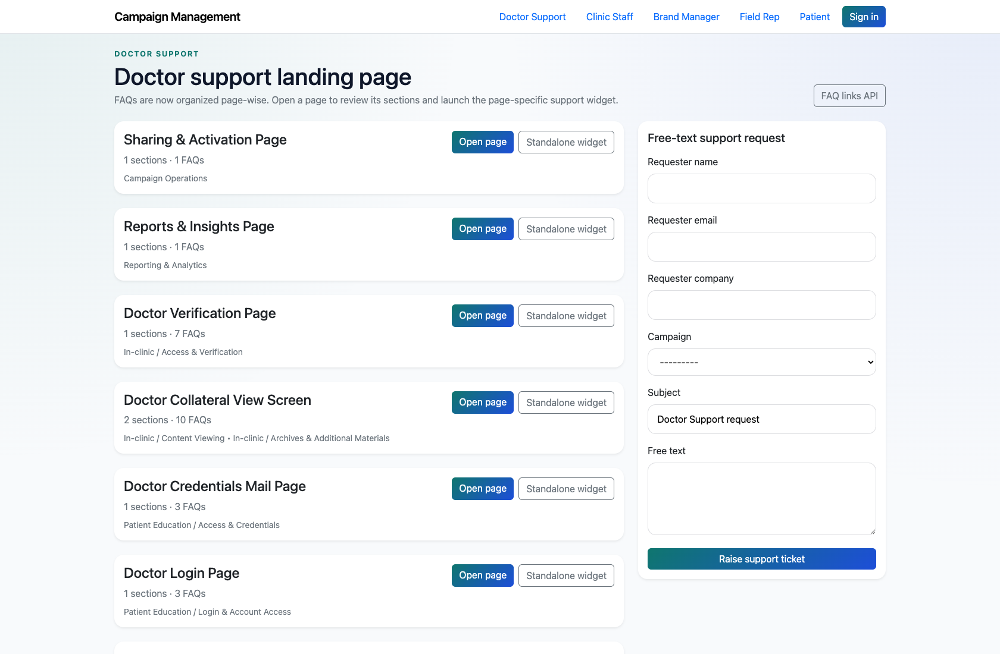

# Platform Overview and Role Map

## Document Purpose

Explain the live product surface, the implemented user roles, and the handoff points between self-service support, project-management triage, and ticket execution.

## Primary User

Internal trainer, implementation lead, or any new team member onboarding to the platform.

## Entry Point

`http://127.0.0.1:8002/`

## Workflow Summary

- The product is a Django-based campaign operations hub with public support experiences and authenticated PM/ticketing dashboards.
- Self-service users enter through role-specific support hubs, while internal teams use the PM dashboard, ticket queue, and reporting pages.
- The implemented product centers on support enablement, escalation, reporting, and ticket routing rather than separate branded portals for every role.

## Role Diagram

## Step-By-Step Instructions

### Step 1. Open the platform home page

- What the user does: Open the root URL to view the shared navigation and campaign landing page.
- What the user sees: A public home page with campaign summary content plus links into every role-specific support center.
- Why the step matters: This is the simplest way to orient a new user to the main product surfaces before discussing role-specific tasks.
- Expected result: The trainer can point to the support-role navigation, sign-in path, and campaign context on one screen.
- Common issues or trainer notes: Use this step to explain that most external users stay in the public support flows, while internal users move into authenticated dashboards.
- Screenshot placeholder:
  - Suggested file path: `assets/platform-overview-and-role-map/01-homepage.png`
  - Screenshot caption: Platform home page
  - What the screenshot should show: The public landing page, navigation links for every support role, and the sign-in option.

### Step 2. Explain the internal command center

- What the user does: Move from the public home page into the Project Management dashboard after sign-in.
- What the user sees: A decision-focused dashboard with ticket KPIs, pending PM reviews, and navigation to ticketing and performance views.
- Why the step matters: This screen anchors every internal workflow and shows where unresolved external issues are managed.
- Expected result: New team members understand that `/app/` is the operational hub for PM-led work.
- Common issues or trainer notes: The PM dashboard is the main internal entry point for project managers and is prioritized throughout this pack.
- Screenshot placeholder:
  - Suggested file path: `assets/platform-overview-and-role-map/02-project-manager-dashboard.png`
  - Screenshot caption: Project Management dashboard
  - What the screenshot should show: The dashboard hero, KPI cards, and operational action links.

### Step 3. Show the self-service support experience

- What the user does: Open a live role-specific support center such as Doctor Support.
- What the user sees: Page-wise FAQ cards, widget launch links, and escalation options that feed the PM queue.
- Why the step matters: This shows how external users begin a support journey without requiring a separate authenticated portal.
- Expected result: The audience understands where self-service begins and how issues reach the internal team if unresolved.
- Common issues or trainer notes: This implementation differs from older extracted notes that describe richer standalone portals for some roles.
- Screenshot placeholder:
  - Suggested file path: `assets/platform-overview-and-role-map/03-doctor-support-landing.png`
  - Screenshot caption: Role-based support landing page
  - What the screenshot should show: The doctor support center with page-wise FAQ cards and the free-text support block.

### Step 4. Connect role handoffs end to end

- What the user does: Walk through the role map from support user to PM review to departmental ticket ownership.
- What the user sees: A clear explanation of where each workflow starts, what happens when an issue is unresolved, and which role owns the next action.
- Why the step matters: This gives trainers a single narrative to introduce the whole system before diving into detail decks.
- Expected result: Participants can describe the high-level journey without needing to inspect the codebase.
- Common issues or trainer notes: Use the role map and flow diagram in this manual when presenting to new internal teams.
- Screenshot placeholder:
  - Suggested file path: `assets/platform-overview-and-role-map/04-field-rep-support-landing.png`
  - Screenshot caption: Field Rep support entry point
  - What the screenshot should show: A second role-based support center to reinforce that each audience gets its own support catalog.

## Success Criteria

- The audience can name the implemented user roles and their starting pages.
- The audience can explain how public support flows hand unresolved issues into the PM dashboard.
- The audience understands that the codebase currently emphasizes support, PM operations, reporting, and ticketing over custom role-specific portals.

## Related Documents

- `README.md`
- `docs/extracted/our-systems.txt`
- `docs/extracted/customer-support.txt`
- `docs/extracted/ticketing.txt`

## Status

Live-verified against the application on 2026-04-11. Older extracted notes mention richer role-specific portals, but the implemented product surface is primarily role-specific support centers plus PM and ticketing dashboards.
