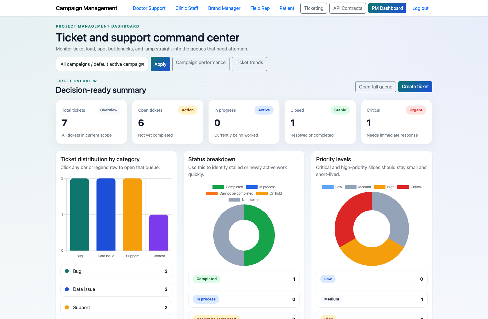
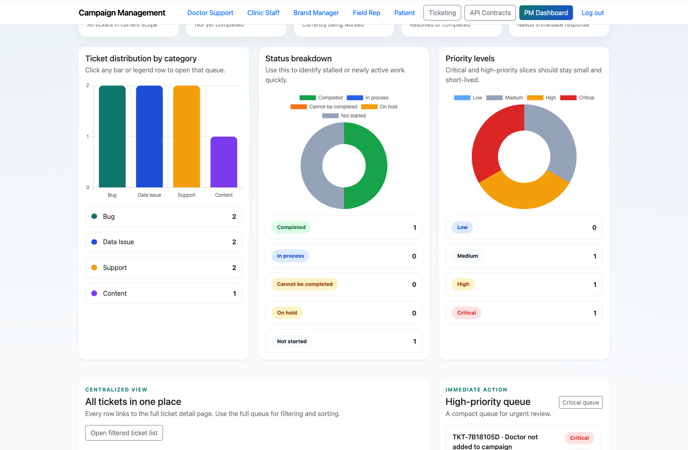
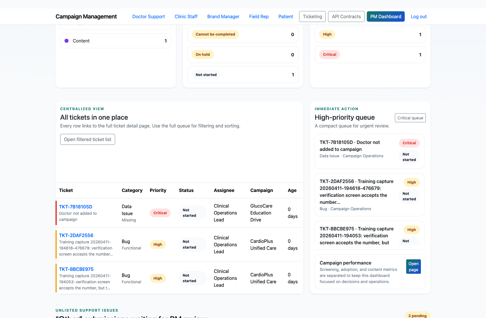
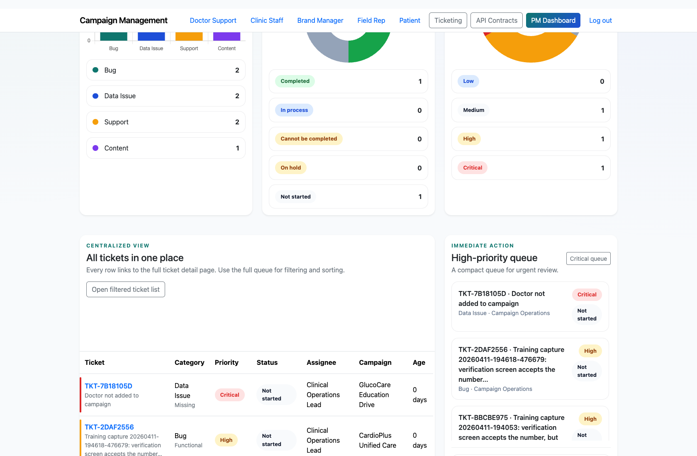

# Project Manager Dashboard and Triage

## Document Purpose

Document how a Project Manager uses the command-center dashboard to monitor workload, inspect pending items, and launch the next operational action.

## Primary User

Project Manager

## Entry Point

`http://127.0.0.1:8002/accounts/dev-login/`

## Workflow Summary

- The PM dashboard centralizes ticket KPIs, quick links, pending support reviews, a high-priority queue, and operational drill-downs.
- Campaign filters can change the dashboard scope without leaving the page.
- The page is the fastest way to move from monitoring into ticket creation or deeper analysis.

## Step-By-Step Instructions

### Step 1. Sign in and open the PM dashboard

- What the user does: Use the development login shortcut or the standard authenticated sign-in flow, then open `/app/`.
- What the user sees: A dashboard hero area, campaign filter, and quick links for ticketing and performance.
- Why the step matters: This is the primary operational entry point for PM-led work.
- Expected result: The PM lands on the dashboard without needing to open multiple admin pages.
- Common issues or trainer notes: In the demo environment, `/accounts/dev-login/` is the fastest path for capture and training.
- Screenshot placeholder:
  - Suggested file path: `assets/project-manager-dashboard-and-triage/01-dashboard-overview.png`
  - Screenshot caption: PM dashboard overview
  - What the screenshot should show: The hero section, campaign filter, and shortcut links to core PM tools.

### Step 2. Review summary KPIs and the current queue shape

- What the user does: Scan the KPI cards and category, status, and priority breakdowns.
- What the user sees: Decision-ready counts for total tickets, open work, critical issues, and queue distribution.
- Why the step matters: This lets the PM understand workload and urgency before drilling into the queue.
- Expected result: The PM knows which queue slices deserve immediate attention.
- Common issues or trainer notes: Use the category and status blocks to explain how the dashboard surfaces bottlenecks without opening the full ticket list first.
- Screenshot placeholder:
  - Suggested file path: `assets/project-manager-dashboard-and-triage/02-dashboard-operational-details.png`
  - Screenshot caption: PM dashboard KPI and queue breakdown
  - What the screenshot should show: Summary cards plus the dashboard breakdowns for category, status, and priority.

### Step 3. Inspect unresolved support submissions

- What the user does: Scroll to the PM review table for “Other” submissions that came from widgets or the assistant.
- What the user sees: A pending-review table with the originating system, flow, page context, and the escalation action.
- Why the step matters: This connects public support journeys directly into PM operations.
- Expected result: The PM can decide whether to raise a formal ticket from the unresolved issue.
- Common issues or trainer notes: If the table is empty, trainers should explain that unresolved support requests are created only when users choose “Other” or submit a PM-review route.
- Screenshot placeholder:
  - Suggested file path: `assets/project-manager-dashboard-and-triage/03-dashboard-pending-issues.png`
  - Screenshot caption: PM review queue
  - What the screenshot should show: The table of pending “Other” support submissions waiting for ticket creation.

### Step 4. Launch the next action from the dashboard

- What the user does: Use the quick actions to open the full ticket queue, create a ticket, or move into the performance dashboard.
- What the user sees: Clickable navigation paths that keep the PM inside the main operations loop.
- Why the step matters: The dashboard is designed to reduce context-switching and keep the PM in one command center.
- Expected result: The PM can move from overview to execution in one click.
- Common issues or trainer notes: Show both the full queue and the campaign performance link so the PM understands the dashboard’s dual operational and analytical roles.
- Screenshot placeholder:
  - Suggested file path: `assets/project-manager-dashboard-and-triage/04-dashboard-high-priority-queue.png`
  - Screenshot caption: High-priority queue from the PM dashboard
  - What the screenshot should show: The high-priority queue card and contextual launch paths into the detailed ticket list.

## Success Criteria

- The PM can find current workload, pending support reviews, and urgent tickets without leaving `/app/`.
- The PM can explain when to stay on the dashboard versus when to open ticketing or performance views.

## Related Documents

- `README.md`
- `docs/testing-guide.md`

## Status

Live-verified against the seeded demo environment on 2026-04-11.
