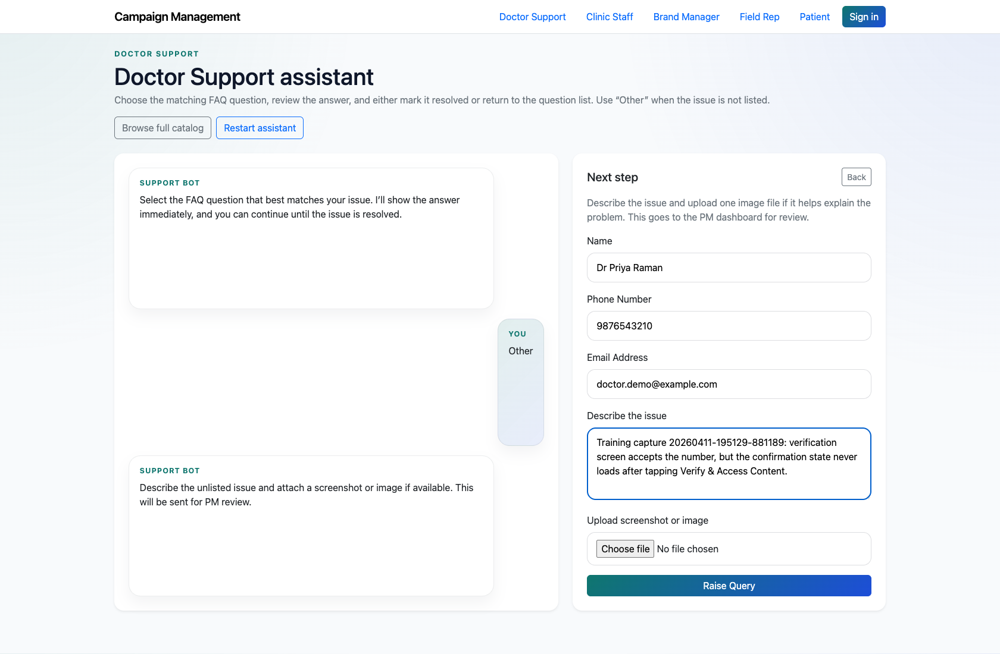
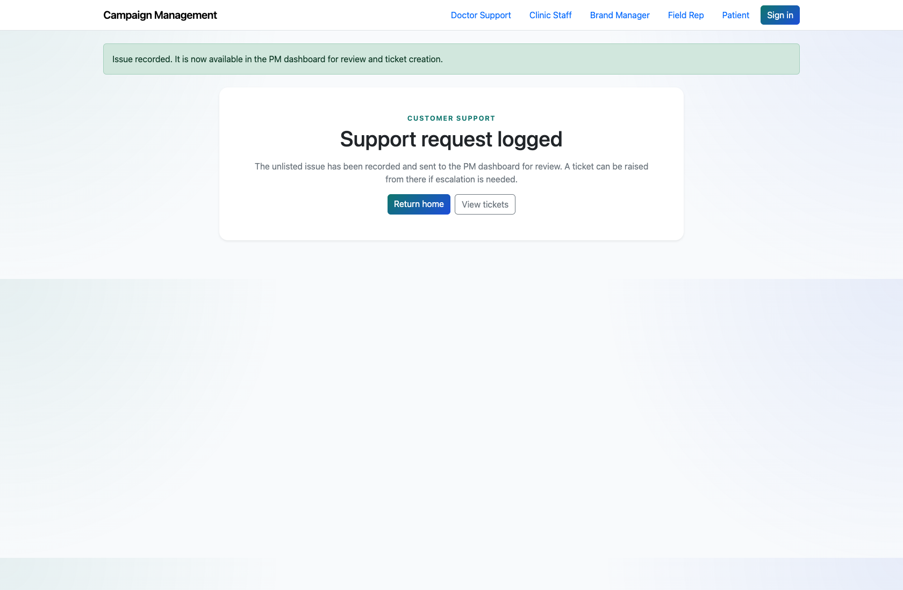
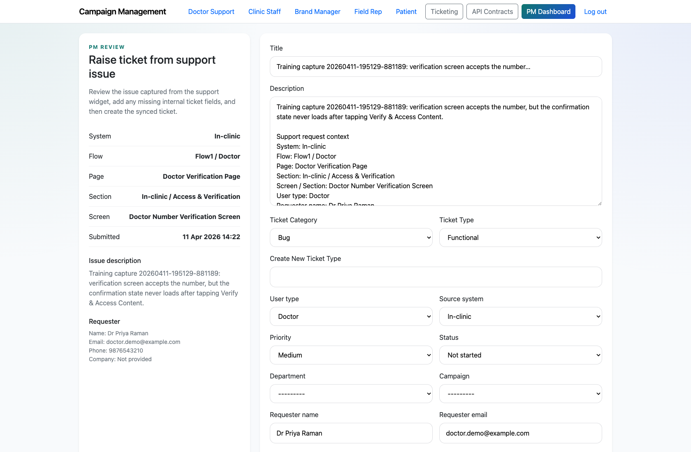
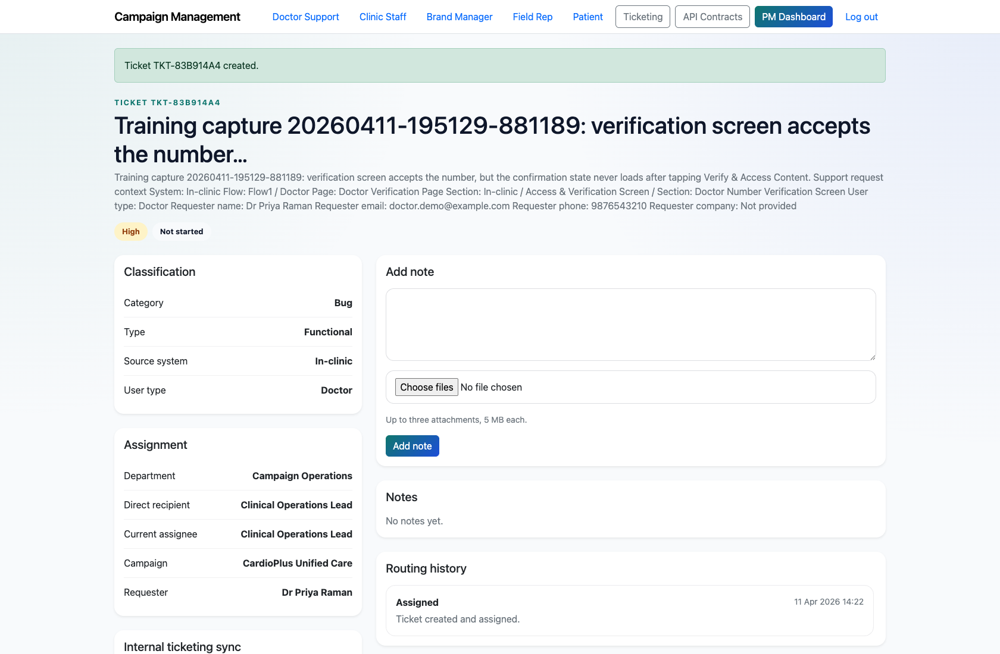

# Project Manager Review of “Other” Support Submissions

## Document Purpose

Document the end-to-end escalation path from an unresolved assistant/widget issue into a PM-reviewed ticket.

## Primary User

Project Manager

## Entry Point

`http://127.0.0.1:8002/support/doctor/assistant/`

## Workflow Summary

- Public users can select “Other” in the guided support assistant or widget when no FAQ resolves their issue.
- Those submissions land in the PM dashboard for review before a ticket is created.
- The PM can open the pre-filled raise-ticket screen, confirm routing, and create the formal ticket.

## Step-By-Step Instructions

### Step 1. Capture the unresolved issue in the assistant

- What the user does: A support user drills down to the relevant system, flow, and screen, then chooses “Other” and describes the issue.
- What the user sees: The assistant’s “Other issue” form with fields for name, phone number, email, description, and optional image upload.
- Why the step matters: This path preserves the context the PM needs to classify the problem accurately.
- Expected result: The unresolved issue is ready to be submitted for PM review.
- Common issues or trainer notes: This is the core public-to-internal escalation handoff in the live product.
- Screenshot placeholder:
  - Suggested file path: `assets/project-manager-review-other-submissions/01-doctor-assistant-other-form.png`
  - Screenshot caption: Assistant unresolved issue form
  - What the screenshot should show: The guided support assistant after “Other” is selected, with the PM-review form visible.

### Step 2. Confirm that the support request was logged

- What the user does: Submit the unresolved issue form from the assistant.
- What the user sees: A success page confirming that the issue is recorded and available in the PM dashboard.
- Why the step matters: This reassures the external user and sets expectations that the issue has moved into PM review.
- Expected result: A `SupportRequest` exists in pending PM review status.
- Common issues or trainer notes: Use the success message wording during training so users understand they are not yet looking at a final support resolution.
- Screenshot placeholder:
  - Suggested file path: `assets/project-manager-review-other-submissions/02-doctor-request-success.png`
  - Screenshot caption: Support request logged confirmation
  - What the screenshot should show: The confirmation page that appears after an unresolved issue is submitted for PM review.

### Step 3. Review the pending issue on the PM dashboard

- What the user does: Open `/app/` and locate the pending “Other” submission in the PM review table.
- What the user sees: The system, user type, flow, page, section, screen, issue description, and the `Raise Ticket` action.
- Why the step matters: This is where the PM decides whether the issue should become a ticket and where it should be routed.
- Expected result: The PM has enough context to continue into ticket creation without re-contacting the user.
- Common issues or trainer notes: Use this step to show that the assistant preserves the screen-level context in the PM review queue.
- Screenshot placeholder:
  - Suggested file path: `assets/project-manager-review-other-submissions/03-pm-pending-review.png`
  - Screenshot caption: Pending unresolved issue in the PM queue
  - What the screenshot should show: The PM dashboard table row that corresponds to the just-submitted unresolved issue.

### Step 4. Create the formal ticket from the pre-filled PM form

- What the user does: Open the `Raise Ticket` screen, confirm the category and type, choose a department and campaign, and submit the form.
- What the user sees: A ticket-creation page pre-filled with the support request description and routing context.
- Why the step matters: This minimizes re-entry and keeps the original support context attached to the ticket.
- Expected result: A new ticket is created and linked back to the originating support request.
- Common issues or trainer notes: The PM only needs to fill missing internal routing fields such as department and campaign.
- Screenshot placeholder:
  - Suggested file path: `assets/project-manager-review-other-submissions/04-raise-ticket-form.png`
  - Screenshot caption: Raise ticket from support issue
  - What the screenshot should show: The PM review form with support context pre-filled and ready for final ticket creation.

### Step 5. Verify the created ticket detail

- What the user does: Open the resulting ticket detail page after the PM submits the synced ticket form.
- What the user sees: The new ticket’s title, description, classification, assignment, and workflow controls.
- Why the step matters: This confirms the unresolved support issue is now in the internal execution workflow.
- Expected result: The PM can hand the work off to the correct department or begin managing it immediately.
- Common issues or trainer notes: If an image was uploaded, trainers should also point out where the resulting note attachment appears on the ticket detail page.
- Screenshot placeholder:
  - Suggested file path: `assets/project-manager-review-other-submissions/05-raised-ticket-detail.png`
  - Screenshot caption: Ticket created from a support request
  - What the screenshot should show: The resulting ticket detail page after the PM raises the synced ticket.

## Success Criteria

- The audience can explain how unresolved support issues move into PM review.
- The PM can create a formal ticket without losing system, flow, or page context.

## Related Documents

- `README.md`
- `docs/testing-guide.md`
- `docs/support-widget-integration.md`

## Status

Live-verified against the assistant, PM dashboard, and ticket-creation flow on 2026-04-11.
