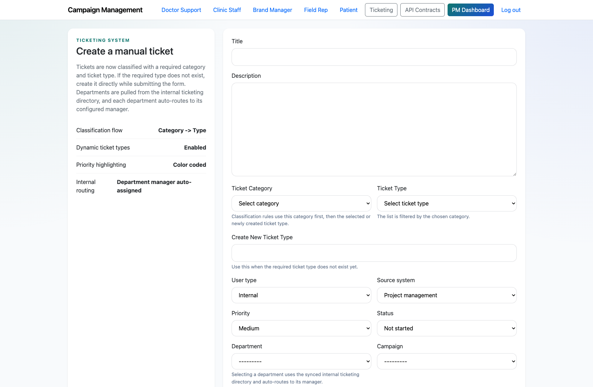
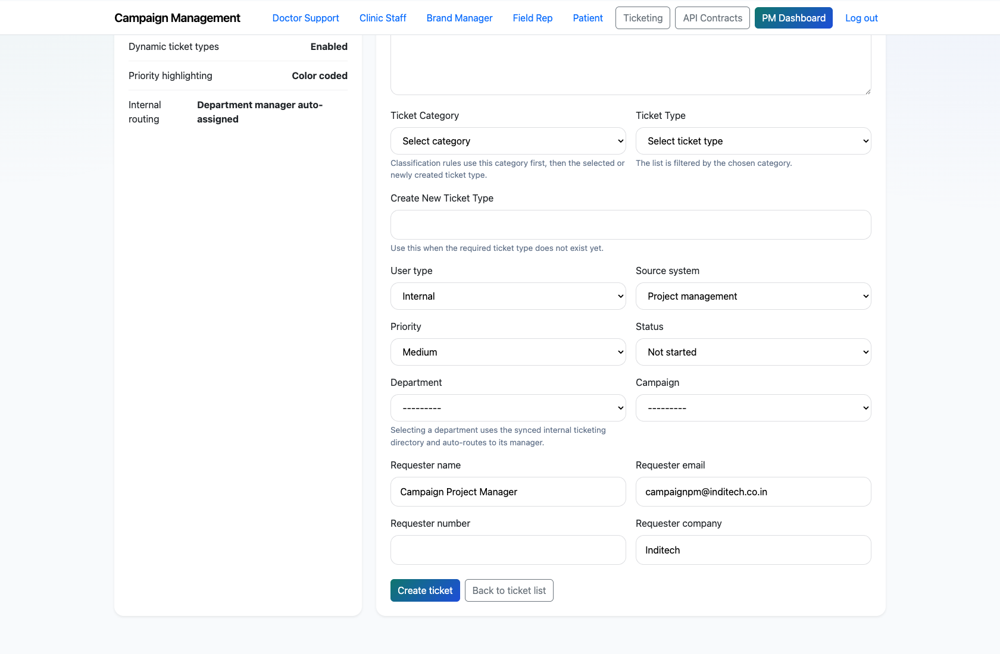
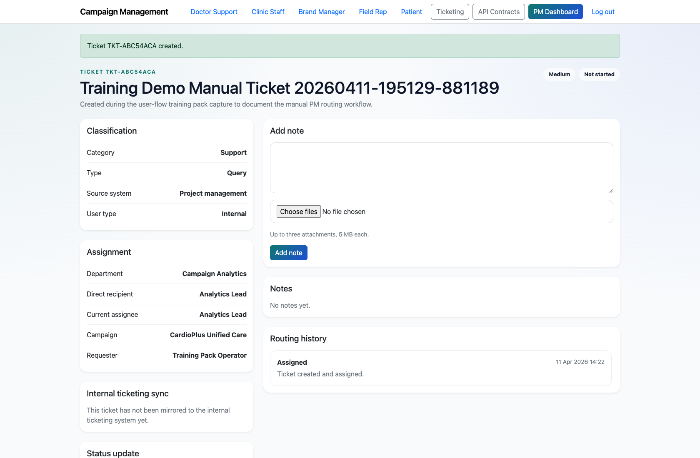
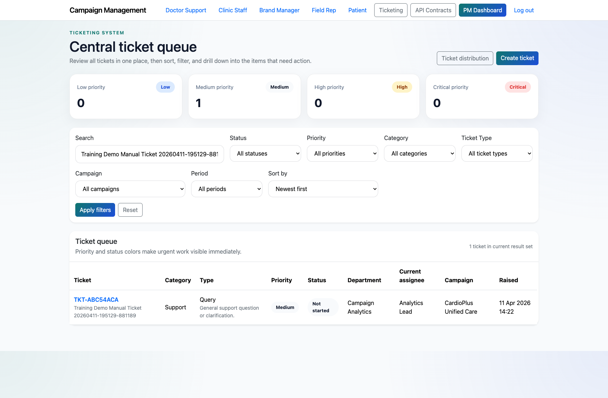

# Project Manager Manual Ticket Creation and Routing

## Document Purpose

Document how a Project Manager creates a new ticket directly from the ticketing workspace when the issue did not originate in the support assistant or widget.

## Primary User

Project Manager

## Entry Point

`http://127.0.0.1:8002/ticketing/new/`

## Workflow Summary

- The PM can create tickets directly from `/ticketing/new/` using the configured categories, ticket types, and departments.
- The form supports category and ticket-type selection, source-system tagging, campaign association, requester details, and status/priority defaults.
- On submission, the PM lands directly on the ticket detail page to continue routing or execution.

## Step-By-Step Instructions

### Step 1. Open the ticket creation form

- What the user does: From the PM dashboard or ticket queue, choose `Create ticket`.
- What the user sees: A form for the title, description, category, ticket type, user type, source system, priority, department, campaign, and requester details.
- Why the step matters: This is the starting point for manually raised internal issues, back-office requests, or PM-created escalations.
- Expected result: The PM is ready to enter the full routing payload for the new issue.
- Common issues or trainer notes: Use the live form to show the seeded department and taxonomy options during training.
- Screenshot placeholder:
  - Suggested file path: `assets/project-manager-manual-ticket-creation/01-ticket-create-form.png`
  - Screenshot caption: Manual ticket creation form
  - What the screenshot should show: The `Create ticket` form with routing, classification, and requester fields visible.

### Step 2. Complete classification and routing

- What the user does: Choose the ticket category, type, priority, department, and campaign, then confirm the requester details.
- What the user sees: A routing-ready form that can classify the ticket before it is created.
- Why the step matters: Correct classification and routing reduce rework later in the lifecycle.
- Expected result: The form is complete and ready to submit.
- Common issues or trainer notes: If the desired type is missing, the PM can create a new ticket type inline during submission.
- Screenshot placeholder:
  - Suggested file path: `assets/project-manager-manual-ticket-creation/02-ticket-create-routing.png`
  - Screenshot caption: Manual ticket routing fields
  - What the screenshot should show: The lower portion of the ticket form where the PM chooses department, campaign, and requester details.

### Step 3. Create the ticket and review the result

- What the user does: Submit the form and open the resulting ticket detail page.
- What the user sees: A new ticket with the chosen classification, assignment, requester details, and workflow controls.
- Why the step matters: This is where the PM confirms the new issue entered the system as expected.
- Expected result: The ticket exists in the queue and can be delegated, updated, or reviewed immediately.
- Common issues or trainer notes: In training, point out that the PM lands on the detail page rather than back on the list view.
- Screenshot placeholder:
  - Suggested file path: `assets/project-manager-manual-ticket-creation/03-manual-ticket-detail.png`
  - Screenshot caption: Manual ticket detail page
  - What the screenshot should show: The detail page of a newly created manual ticket.

### Step 4. Return to the queue and validate the entry

- What the user does: Open the ticket queue and confirm the new ticket appears in the expected sort order or filtered slice.
- What the user sees: The central queue with the newly created ticket listed alongside existing work.
- Why the step matters: This demonstrates where manually created work becomes visible to the broader operations team.
- Expected result: The PM can see the new ticket in the queue and continue into execution if needed.
- Common issues or trainer notes: Use search or filters to highlight the new ticket quickly during training.
- Screenshot placeholder:
  - Suggested file path: `assets/project-manager-manual-ticket-creation/04-ticket-queue-filtered.png`
  - Screenshot caption: Manual ticket visible in the queue
  - What the screenshot should show: The ticket queue filtered or sorted so the newly created manual ticket is visible.

## Success Criteria

- The PM can create a new ticket without relying on a support-originated request.
- The ticket appears in the queue with the expected category, department, and requester context.

## Related Documents

- `README.md`
- `docs/testing-guide.md`

## Status

Live-verified against the ticket-create form and queue on 2026-04-11.
