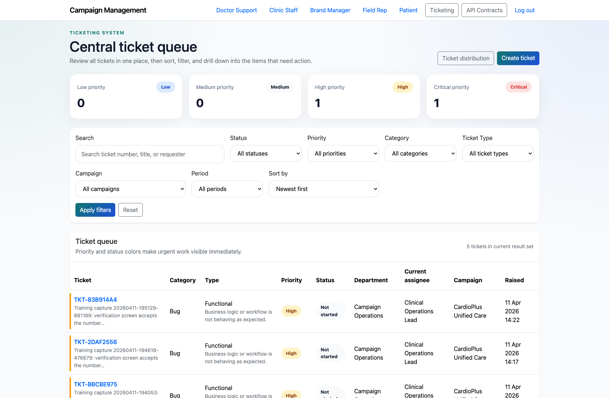
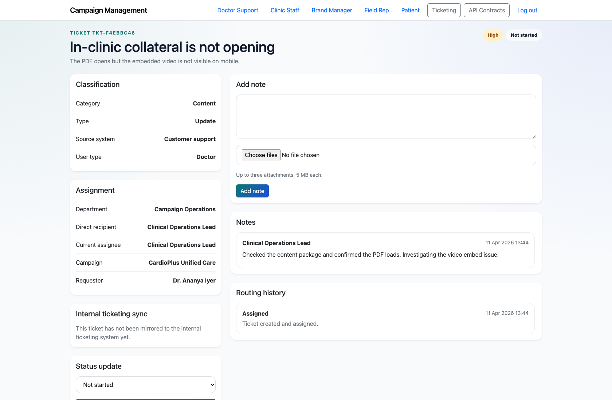
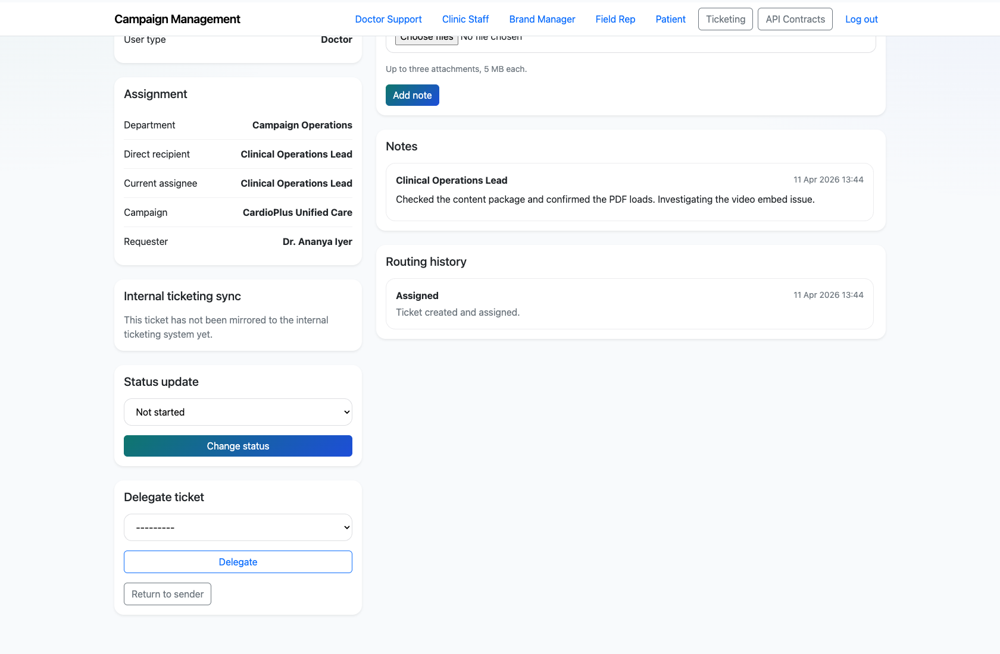

# Department Owner Ticket Execution

## Document Purpose

Document how a departmental owner or support lead works their scoped queue, opens ticket detail, and updates the ticket lifecycle.

## Primary User

Department Owner / Support Lead

## Entry Point

`http://127.0.0.1:8002/admin/login/ then http://127.0.0.1:8002/ticketing/`

## Workflow Summary

- Department owners see a scoped subset of the ticket queue rather than the full PM command center.
- They can open ticket detail pages, change status, delegate the ticket, add notes, and review routing history.
- This workflow is the execution layer that follows PM triage and ticket creation.

## Step-By-Step Instructions

### Step 1. Authenticate as a department owner

- What the user does: Sign in as a staff user and open the ticket queue.
- What the user sees: A ticket list limited to the departmental scope relevant to that user.
- Why the step matters: This keeps operational users focused on the work they own.
- Expected result: The department owner sees only the queue slice they are meant to manage.
- Common issues or trainer notes: In the demo environment, staff users can authenticate through the Django admin login and then navigate into `/ticketing/`.
- Screenshot placeholder:
  - Suggested file path: `assets/department-owner-ticket-execution/01-owner-ticket-queue.png`
  - Screenshot caption: Department-owner ticket queue
  - What the screenshot should show: The scoped queue showing only the tickets visible to the department owner.

### Step 2. Open a ticket from the queue

- What the user does: Select a ticket number from the scoped queue.
- What the user sees: The ticket detail page with classification, assignment, requester data, notes, and routing history.
- Why the step matters: This is the operational workspace for day-to-day execution.
- Expected result: The department owner can review the full context of the issue before making changes.
- Common issues or trainer notes: Use this step to point out the difference between the PM dashboard summary and the detailed execution workspace.
- Screenshot placeholder:
  - Suggested file path: `assets/department-owner-ticket-execution/02-owner-ticket-detail.png`
  - Screenshot caption: Department-owner ticket detail
  - What the screenshot should show: The ticket detail page opened from the scoped queue.

### Step 3. Update status or delegate the work

- What the user does: Use the status-change and delegate controls in the ticket detail sidebar.
- What the user sees: Status and assignee controls that update the ticket without leaving the detail page.
- Why the step matters: These controls keep ticket execution lightweight and traceable.
- Expected result: The department owner can move work forward or hand it to the right individual.
- Common issues or trainer notes: Show the routing controls even if you do not change the live ticket during training.
- Screenshot placeholder:
  - Suggested file path: `assets/department-owner-ticket-execution/03-owner-routing-actions.png`
  - Screenshot caption: Department-owner routing controls
  - What the screenshot should show: The status update and delegation controls on the ticket detail page.

### Step 4. Record execution notes and review history

- What the user does: Use the note form and review the routing history timeline on the ticket detail page.
- What the user sees: A notes section for operational commentary plus an immutable routing history panel.
- Why the step matters: These sections document how the ticket was worked over time.
- Expected result: The department owner understands where to record progress and how to audit prior movement.
- Common issues or trainer notes: If attachments are used in production, explain that note uploads appear alongside the note history.
- Screenshot placeholder:
  - Suggested file path: `assets/department-owner-ticket-execution/04-owner-notes-and-history.png`
  - Screenshot caption: Notes and routing history
  - What the screenshot should show: The lower portion of the ticket detail page with notes and routing history visible.

## Success Criteria

- The department owner can open only their relevant queue and work a ticket without PM assistance.
- The department owner knows where to update status, delegate work, and record notes.

## Related Documents

- `README.md`
- `docs/testing-guide.md`

## Status

Live-verified using a staff department-owner account and scoped ticket queue on 2026-04-11.
