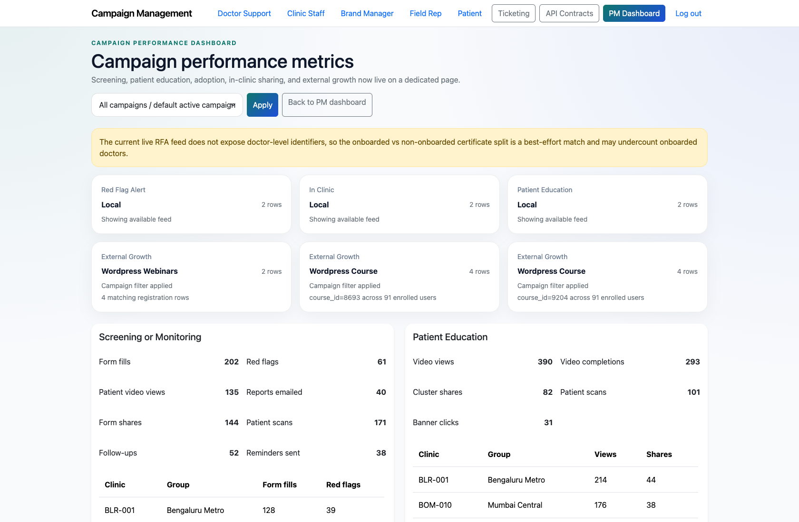
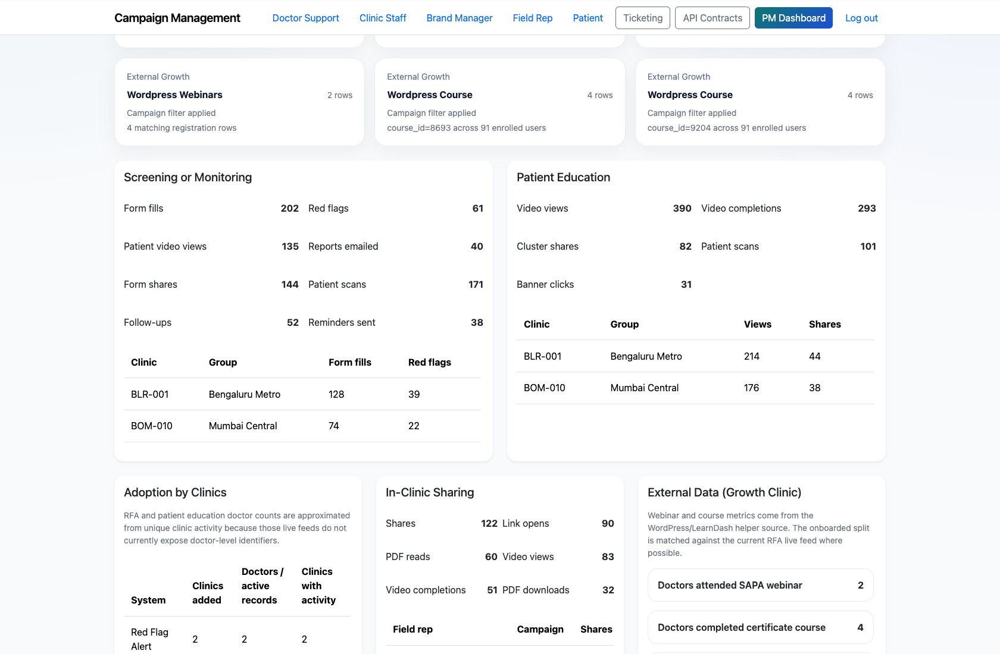
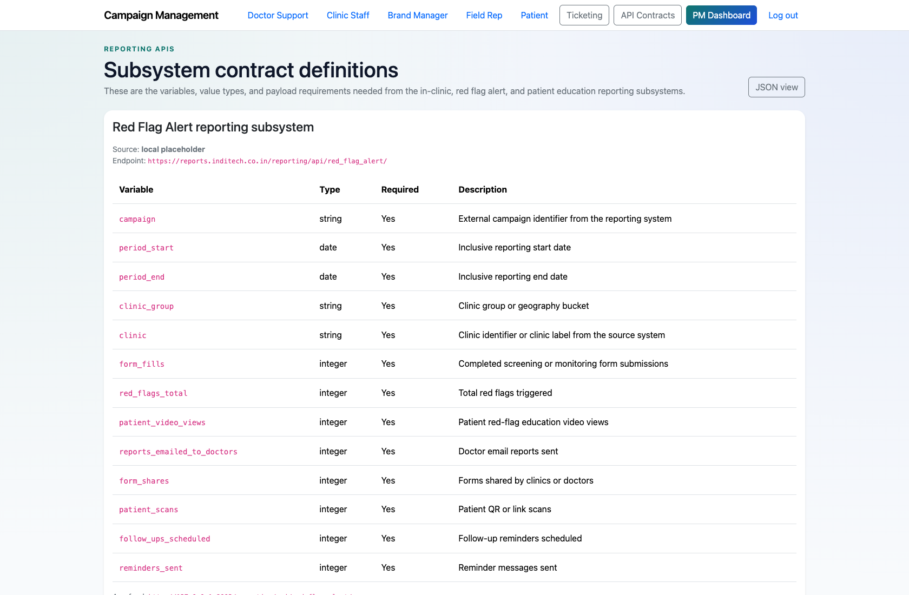
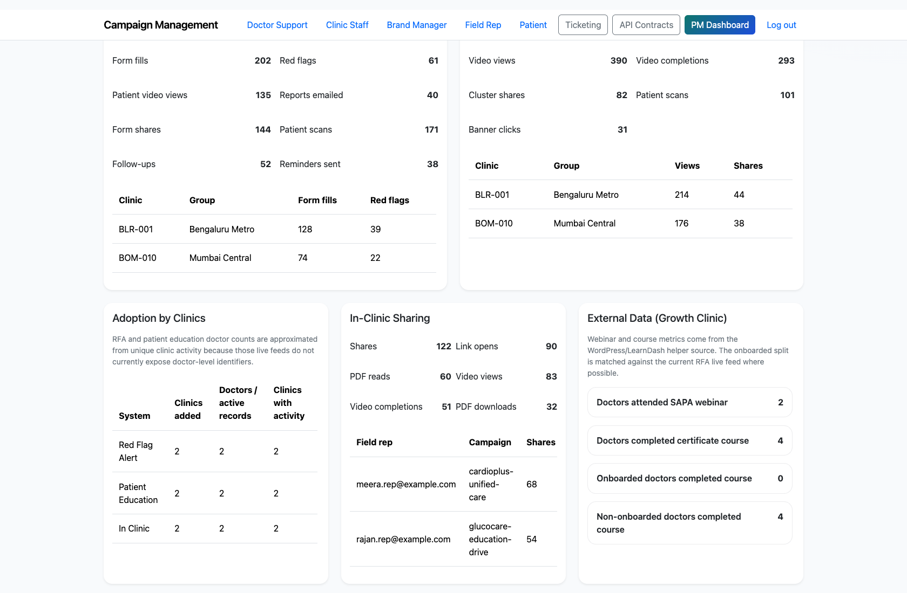

# Project Manager Campaign Performance and Reporting

## Document Purpose

Document how a Project Manager reviews campaign performance, subsystem metrics, and reporting contracts.

## Primary User

Project Manager

## Entry Point

`http://127.0.0.1:8002/app/performance/`

## Workflow Summary

- The performance dashboard separates analytical review from the PM dashboard’s operational triage surface.
- It aggregates campaign metrics, subsystem sections, adoption data, and external growth metrics.
- The reporting contracts page exposes the expected JSON contract for downstream integration or validation.

## Step-By-Step Instructions

### Step 1. Open the campaign performance dashboard

- What the user does: From the PM dashboard, choose `Campaign performance` or navigate directly to `/app/performance/`.
- What the user sees: A performance-oriented dashboard with campaign filter controls and metric sections.
- Why the step matters: This keeps analytical review separate from the main ticket operations surface.
- Expected result: The PM can switch from triage mode into performance review without losing campaign context.
- Common issues or trainer notes: Use the campaign filter to demonstrate how PMs can narrow the scope when discussing a single program.
- Screenshot placeholder:
  - Suggested file path: `assets/project-manager-campaign-performance-and-reporting/01-performance-dashboard-overview.png`
  - Screenshot caption: Campaign performance dashboard
  - What the screenshot should show: The top of the performance dashboard with campaign scope controls and summary messaging.

### Step 2. Review campaign KPIs and subsystem sections

- What the user does: Scroll through the subsystem blocks and supporting KPI cards.
- What the user sees: Live-or-fallback reporting sections for Red Flag Alert, In-clinic, Patient Education, adoption, and external growth.
- Why the step matters: This is where the PM reviews health and growth across delivery systems.
- Expected result: The PM can describe current performance without manually aggregating multiple reporting feeds.
- Common issues or trainer notes: If live data is unavailable, the UI still presents fallback content sourced from local snapshots.
- Screenshot placeholder:
  - Suggested file path: `assets/project-manager-campaign-performance-and-reporting/02-performance-dashboard-kpis.png`
  - Screenshot caption: Performance metrics and subsystem sections
  - What the screenshot should show: The KPI cards and subsystem summaries inside the campaign performance dashboard.

### Step 3. Open the reporting contracts reference

- What the user does: Navigate to `/reporting/contracts/` from the global nav.
- What the user sees: The human-readable reporting contract page that documents the expected payload structure.
- Why the step matters: This helps PMs, analysts, and implementers align on what the reporting APIs return.
- Expected result: The PM knows where to find contract definitions when investigating metric discrepancies.
- Common issues or trainer notes: This page is especially useful during cross-team troubleshooting or data-validation conversations.
- Screenshot placeholder:
  - Suggested file path: `assets/project-manager-campaign-performance-and-reporting/03-reporting-contracts.png`
  - Screenshot caption: Reporting contracts reference
  - What the screenshot should show: The reporting contracts page that documents the subsystem payload structure.

### Step 4. Use performance insights to inform operational work

- What the user does: Cross-reference performance findings with ticketing and PM triage as needed.
- What the user sees: A clear separation between analytical review and operational workflows, linked through shared campaign scope.
- Why the step matters: PMs often move from performance anomalies into ticketing or support follow-up.
- Expected result: The PM can connect performance review to operational follow-through.
- Common issues or trainer notes: This workflow intentionally complements, rather than duplicates, the main PM dashboard.
- Screenshot placeholder:
  - Suggested file path: `assets/project-manager-campaign-performance-and-reporting/04-performance-dashboard-system-status.png`
  - Screenshot caption: Performance dashboard operational context
  - What the screenshot should show: A lower section of the dashboard that helps trainers explain how reporting context supports operational decisions.

## Success Criteria

- The PM can use the performance dashboard to review campaign health independently from ticket triage.
- The PM knows where to inspect the reporting payload contract when needed.

## Related Documents

- `README.md`
- `docs/reporting-api-contract.md`
- `docs/testing-guide.md`

## Status

Live-verified using the performance dashboard and reporting contract page on 2026-04-11.
