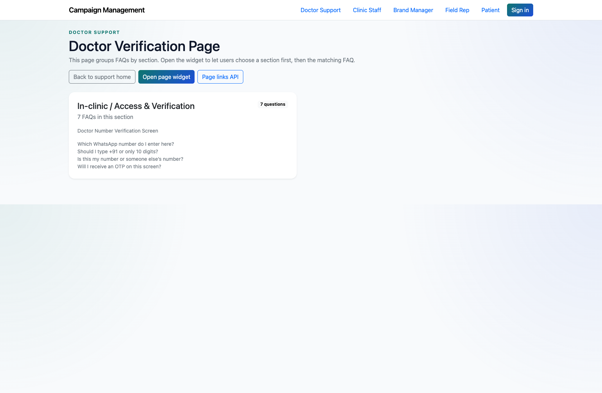
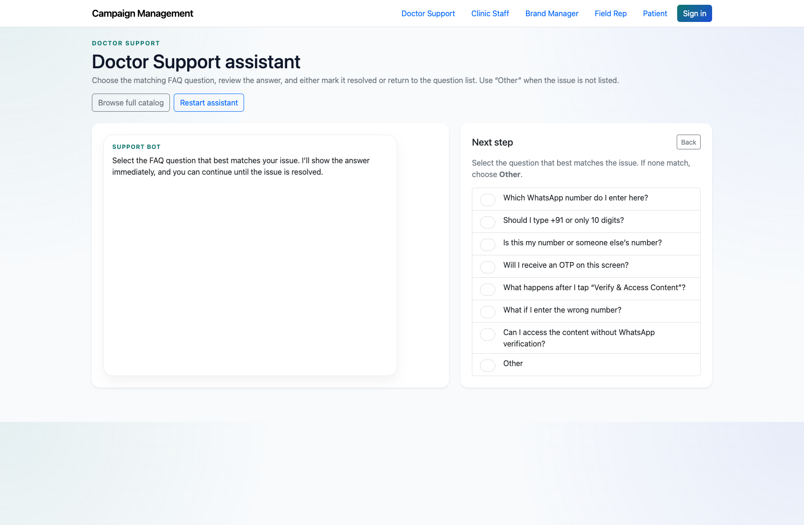

# Doctor Self-Service Support

## Document Purpose

Document how a doctor uses the support landing page, FAQ pages, widgets, and assistant to resolve issues or escalate them.

## Primary User

Doctor

## Entry Point

`http://127.0.0.1:8002/support/doctor/`

## Workflow Summary

- Doctors enter through a dedicated support center with page-wise FAQ cards for Customer Support, In-clinic, Patient Education, and Red Flag Alert topics.
- Each page can be opened as a full article set or as an embeddable widget.
- If the issue is not solved, the doctor can escalate through the assistant or free-text support form.

## Step-By-Step Instructions

### Step 1. Open the Doctor Support landing page

- What the user does: Navigate to `/support/doctor/`.
- What the user sees: A page-wise FAQ landing page with cards for each supported doctor-facing screen or journey.
- Why the step matters: This is the doctor’s main starting point for self-service support.
- Expected result: The doctor can identify the relevant screen or flow without needing an internal user.
- Common issues or trainer notes: The support catalog is organized page-wise, which is different from a generic help-center structure.
- Screenshot placeholder:
  - Suggested file path: `assets/doctor-self-service-support/01-doctor-support-landing.png`
  - Screenshot caption: Doctor support landing page
  - What the screenshot should show: The doctor landing page with page-wise FAQ cards and escalation options.

### Step 2. Open a page-wise FAQ view

- What the user does: Choose a page such as the In-clinic doctor verification page.
- What the user sees: A full FAQ page with sections, question cards, and page context.
- Why the step matters: This gives the doctor a richer reading experience than the compact widget.
- Expected result: The doctor can scan the relevant FAQs for the current screen.
- Common issues or trainer notes: Use a page with multiple FAQs during training so the structure is obvious.
- Screenshot placeholder:
  - Suggested file path: `assets/doctor-self-service-support/02-doctor-faq-page.png`
  - Screenshot caption: Doctor FAQ page
  - What the screenshot should show: A doctor FAQ page showing the selected page title, sections, and questions.

### Step 3. Use the guided assistant when the exact page is unclear

- What the user does: Open the doctor support assistant and choose the system, flow, and screen that matches the issue.
- What the user sees: A guided, step-by-step support assistant that narrows the support context before showing answers.
- Why the step matters: This helps doctors who know the problem but not the exact FAQ page name.
- Expected result: The doctor either resolves the issue from a matching answer or chooses “Other.”
- Common issues or trainer notes: The assistant preserves the selected system, flow, and page context for escalation.
- Screenshot placeholder:
  - Suggested file path: `assets/doctor-self-service-support/03-doctor-assistant-question.png`
  - Screenshot caption: Doctor support assistant
  - What the screenshot should show: The assistant after the doctor has chosen a system, flow, and screen and is selecting a question.

### Step 4. Escalate an unresolved issue

- What the user does: Choose `Other` or use the landing-page form when the answer is missing or not resolved.
- What the user sees: A form that records the issue for PM review or direct support follow-up, depending on the entry path.
- Why the step matters: This ensures doctors can continue even when self-service content is incomplete.
- Expected result: The issue is recorded and routed into the internal workflow.
- Common issues or trainer notes: Use the assistant-based escalation when you want to demonstrate the richer PM-review context.
- Screenshot placeholder:
  - Suggested file path: `assets/doctor-self-service-support/04-doctor-widget.png`
  - Screenshot caption: Doctor page-wise support widget
  - What the screenshot should show: The doctor support widget used for compact, embedded support on a single page.

## Success Criteria

- A doctor can find the correct support page or assistant path without internal help.
- A doctor can recognize when to escalate through the assistant or support form.

## Related Documents

- `README.md`
- `docs/support-widget-integration.md`

## Status

Live-verified against the doctor landing page, FAQ page, assistant, and widget on 2026-04-11.
