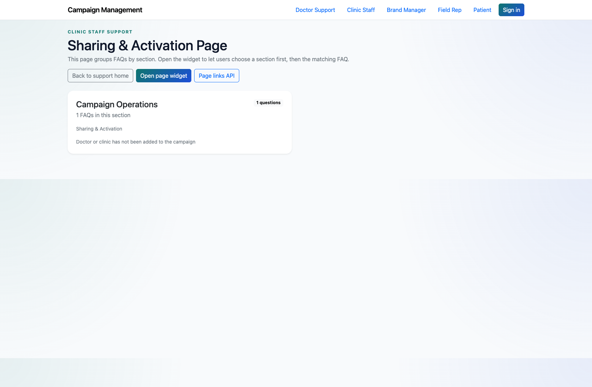
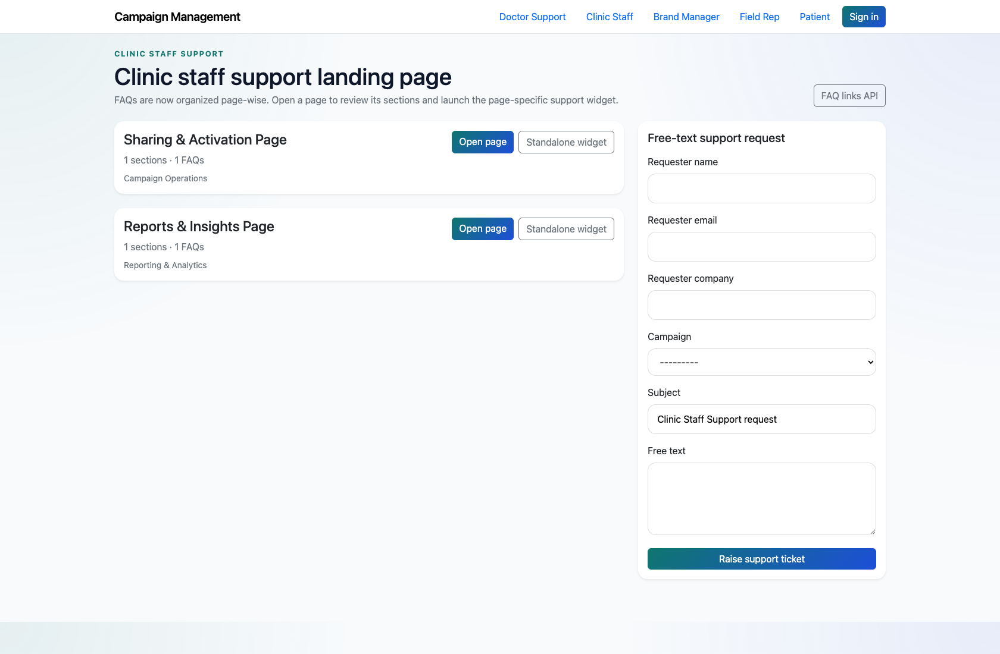

# Clinic Staff Self-Service Support

## Document Purpose

Document the clinic-staff self-service path for shared support topics and escalation into the internal queue.

## Primary User

Clinic Staff

## Entry Point

`http://127.0.0.1:8002/support/clinic_staff/`

## Workflow Summary

- Clinic staff use a lighter support catalog focused on shared operational topics such as support activation and reports.
- They can open page-wise FAQs or submit a free-text request from the landing page.
- This workflow is intentionally smaller than the doctor or field-rep flows in the current implementation.

## Step-By-Step Instructions

### Step 1. Open the Clinic Staff support center

- What the user does: Navigate to `/support/clinic_staff/`.
- What the user sees: A clinic-staff support landing page with a short page-wise FAQ catalog and a free-text request form.
- Why the step matters: This is the implemented entry point for clinic-staff support needs.
- Expected result: Clinic staff can quickly identify the relevant shared support topic.
- Common issues or trainer notes: Explain that the clinic-staff support surface is intentionally narrower than the doctor catalog in the live app.
- Screenshot placeholder:
  - Suggested file path: `assets/clinic-staff-self-service-support/01-clinic-staff-landing.png`
  - Screenshot caption: Clinic Staff support landing page
  - What the screenshot should show: The clinic-staff role page with its smaller FAQ catalog and support form.

### Step 2. Open a shared FAQ page

- What the user does: Choose a page such as `Sharing & Activation Page` or `Reports & Insights Page`.
- What the user sees: A page-level FAQ view with the selected operational topic and corresponding answers.
- Why the step matters: This is the main self-service path for clinic-staff users.
- Expected result: Clinic staff can review the available answers before escalating.
- Common issues or trainer notes: Use a short FAQ page for quick walkthroughs in training.
- Screenshot placeholder:
  - Suggested file path: `assets/clinic-staff-self-service-support/02-clinic-staff-faq-page.png`
  - Screenshot caption: Clinic Staff FAQ page
  - What the screenshot should show: A clinic-staff FAQ page for one of the shared operational support topics.

### Step 3. Escalate when the answer is missing

- What the user does: Submit the free-text support request from the landing page if the FAQ does not resolve the issue.
- What the user sees: A form for requester details, subject, optional campaign, and issue description.
- Why the step matters: This provides a fallback path when the smaller clinic-staff catalog is not enough.
- Expected result: The issue is recorded for internal handling.
- Common issues or trainer notes: Point out that this route differs from the assistant-driven PM-review path used in other support flows.
- Screenshot placeholder:
  - Suggested file path: `assets/clinic-staff-self-service-support/03-clinic-staff-free-text-form.png`
  - Screenshot caption: Clinic Staff free-text support form
  - What the screenshot should show: The landing-page form used to capture a clinic-staff support request.

## Success Criteria

- Clinic staff can use the implemented role page to self-serve shared support topics.
- Clinic staff know how to escalate when the smaller catalog does not answer the question.

## Related Documents

- `README.md`

## Status

Live-verified against the clinic-staff role page and page-wise FAQ flow on 2026-04-11.
