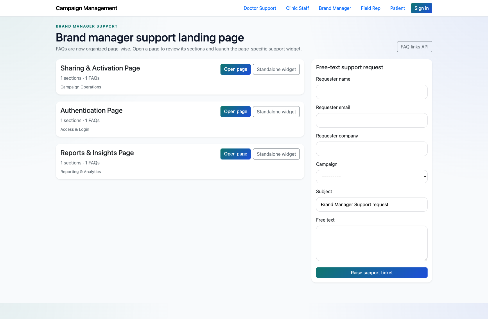
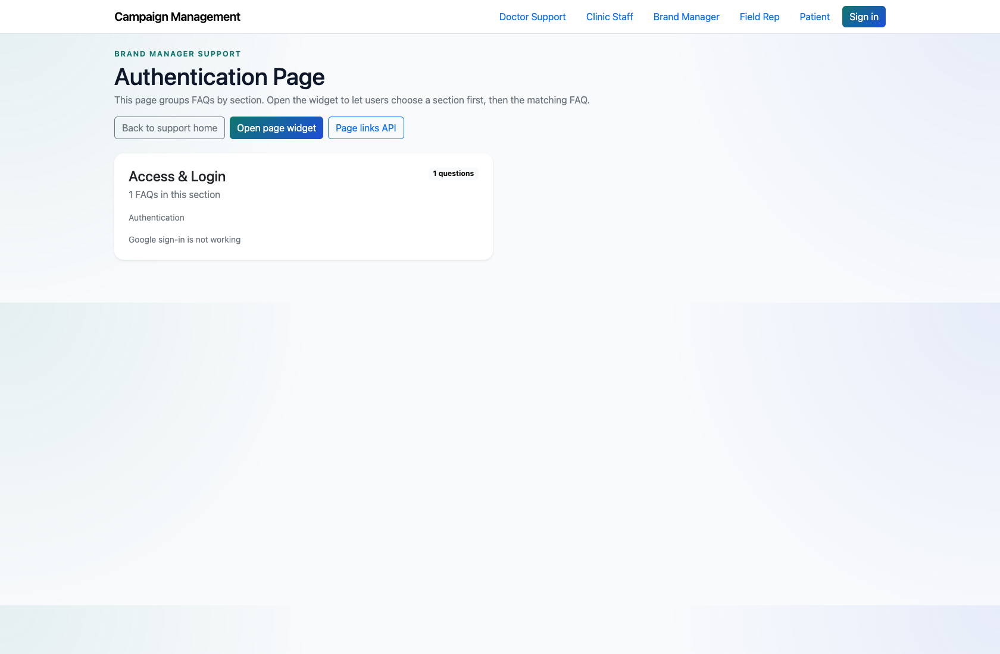

# Brand Manager Self-Service Support

## Document Purpose

Document the implemented brand-manager support center and clarify how it differs from older portal-oriented notes.

## Primary User

Brand Manager

## Entry Point

`http://127.0.0.1:8002/support/brand_manager/`

## Workflow Summary

- The live product exposes brand-manager support as a role-specific support center rather than a separate authenticated portal.
- The available catalog focuses on customer support authentication, sharing, and reports.
- Brand managers can browse page-wise FAQs or escalate through the landing-page support form.

## Step-By-Step Instructions

### Step 1. Open the Brand Manager support center

- What the user does: Navigate to `/support/brand_manager/`.
- What the user sees: A role-specific support landing page for brand-manager topics.
- Why the step matters: This is the actual implemented starting point for brand-manager support in the current product.
- Expected result: The brand manager sees the available support pages and escalation form.
- Common issues or trainer notes: Older extracted notes describe a richer brand-manager portal, but the live product currently implements a support center instead.
- Screenshot placeholder:
  - Suggested file path: `assets/brand-manager-self-service-support/01-brand-manager-landing.png`
  - Screenshot caption: Brand Manager support landing page
  - What the screenshot should show: The brand-manager support center with the available page-wise support cards.

### Step 2. Review an authentication or sharing FAQ page

- What the user does: Open the `Authentication Page` or `Sharing & Activation Page` from the role page.
- What the user sees: A page-wise FAQ view focused on the selected brand-manager support topic.
- Why the step matters: This reflects how brand managers self-serve in the live implementation.
- Expected result: The brand manager can review the relevant answers before escalating.
- Common issues or trainer notes: Use the authentication page for training because it most clearly differentiates brand-manager content from clinic-staff content.
- Screenshot placeholder:
  - Suggested file path: `assets/brand-manager-self-service-support/02-brand-manager-faq-page.png`
  - Screenshot caption: Brand Manager FAQ page
  - What the screenshot should show: A brand-manager FAQ page for one of the available support topics.

### Step 3. Submit a support request when needed

- What the user does: Use the free-text support form on the landing page if the available pages do not resolve the issue.
- What the user sees: A standard support request form that captures requester details and the issue summary.
- Why the step matters: This is the fallback when the support catalog does not cover the required action.
- Expected result: The issue is recorded for internal handling.
- Common issues or trainer notes: Call out the product/documentation mismatch here if trainees expect a dedicated brand-manager portal.
- Screenshot placeholder:
  - Suggested file path: `assets/brand-manager-self-service-support/03-brand-manager-free-text-form.png`
  - Screenshot caption: Brand Manager support request form
  - What the screenshot should show: The landing-page form used to raise a brand-manager support request.

## Success Criteria

- Brand managers understand the implemented support center entry point.
- Trainers can clearly explain the difference between live behavior and older portal-oriented notes.

## Related Documents

- `README.md`
- `docs/extracted/customer-support.txt`

## Status

Live-verified against the brand-manager support center on 2026-04-11. Known mismatch noted against older extracted documentation.
