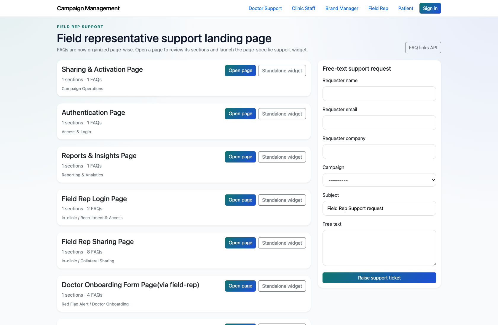
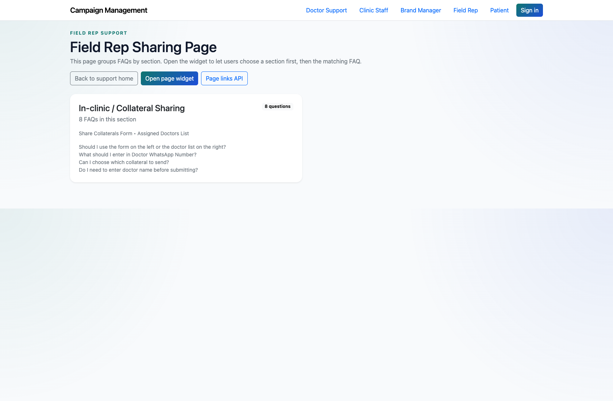
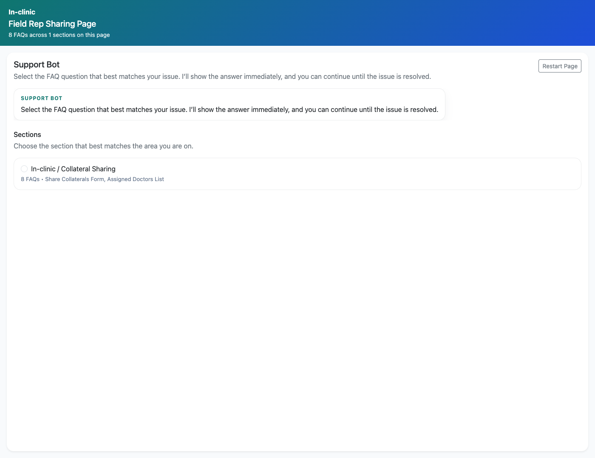
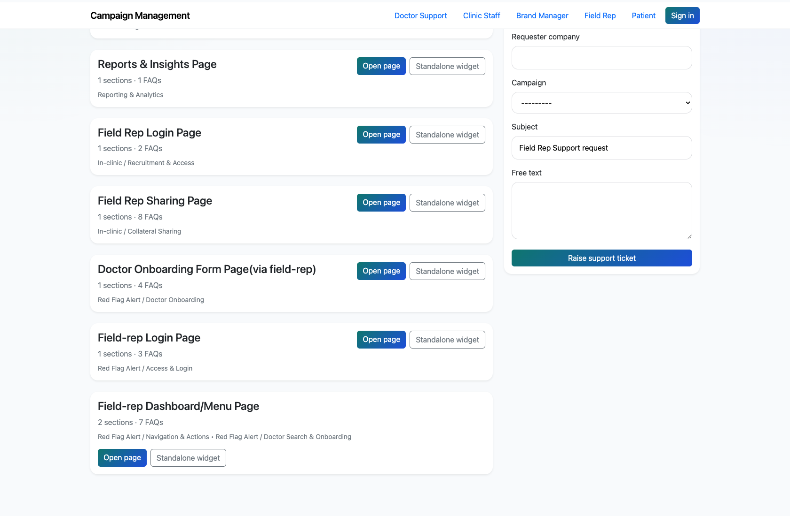

# Field Rep Self-Service Support

## Document Purpose

Document how field reps use the role-specific support center for login, onboarding, sharing, and dashboard-menu issues.

## Primary User

Field Rep

## Entry Point

`http://127.0.0.1:8002/support/field_rep/`

## Workflow Summary

- Field reps have one of the richer public support catalogs in the current product, with In-clinic and Red Flag Alert flow pages.
- The role page exposes page-wise support pages and standalone widgets for field-rep workflows.
- If the content does not resolve the issue, field reps can escalate using the shared support form.

## Step-By-Step Instructions

### Step 1. Open the Field Rep support center

- What the user does: Navigate to `/support/field_rep/`.
- What the user sees: A field-rep support page with page-wise cards for login, sharing, onboarding, dashboard menu, and shared support topics.
- Why the step matters: This is the live field-rep support entry point.
- Expected result: The field rep can identify the closest page or screen name to the current issue.
- Common issues or trainer notes: Use the role page to explain how multiple subsystems are combined into a single support experience.
- Screenshot placeholder:
  - Suggested file path: `assets/field-rep-self-service-support/01-field-rep-landing.png`
  - Screenshot caption: Field Rep support landing page
  - What the screenshot should show: The field-rep support center with its richer catalog of page-wise support cards.

### Step 2. Open a field-rep-specific FAQ page

- What the user does: Choose a field-rep page such as `Field Rep Sharing Page` or `Field Rep Dashboard/Menu Page`.
- What the user sees: A page-level FAQ screen with the selected field-rep questions and answers.
- Why the step matters: This is the primary self-service experience for field-rep issues.
- Expected result: The field rep can review answers tied to the exact screen or flow they are using.
- Common issues or trainer notes: The In-clinic sharing page works well for training because it is easy to describe visually.
- Screenshot placeholder:
  - Suggested file path: `assets/field-rep-self-service-support/02-field-rep-faq-page.png`
  - Screenshot caption: Field Rep FAQ page
  - What the screenshot should show: A field-rep page-wise FAQ view with section-level questions.

### Step 3. Use the standalone widget when embedded support is needed

- What the user does: Open the standalone widget link for a field-rep page.
- What the user sees: A compact support bot experience that can be embedded into another property.
- Why the step matters: This shows how the same content can support embedded experiences for field reps.
- Expected result: The field rep understands the smaller widget flow for quick support access.
- Common issues or trainer notes: This is also a good lead-in to the technical widget-integration workflow deck.
- Screenshot placeholder:
  - Suggested file path: `assets/field-rep-self-service-support/03-field-rep-widget.png`
  - Screenshot caption: Field Rep support widget
  - What the screenshot should show: The compact widget version of a field-rep support page.

### Step 4. Escalate unresolved issues

- What the user does: Submit the support form from the role page when the widget or page content is not enough.
- What the user sees: A standard support request form that captures the user’s issue and optional campaign context.
- Why the step matters: This keeps field-rep issues moving even when a FAQ gap exists.
- Expected result: The issue is handed off to the internal support workflow.
- Common issues or trainer notes: Explain that the live product does not currently implement a separate authenticated field-rep portal beyond support and ticketing context.
- Screenshot placeholder:
  - Suggested file path: `assets/field-rep-self-service-support/04-field-rep-free-text-form.png`
  - Screenshot caption: Field Rep support request form
  - What the screenshot should show: The fallback field-rep support request form on the role page.

## Success Criteria

- Field reps can find the correct page-level support content for their flow.
- Field reps understand the difference between page, widget, and escalation paths.

## Related Documents

- `README.md`
- `docs/support-widget-integration.md`
- `docs/extracted/customer-support.txt`

## Status

Live-verified against the field-rep support center, FAQ page, and widget on 2026-04-11.
