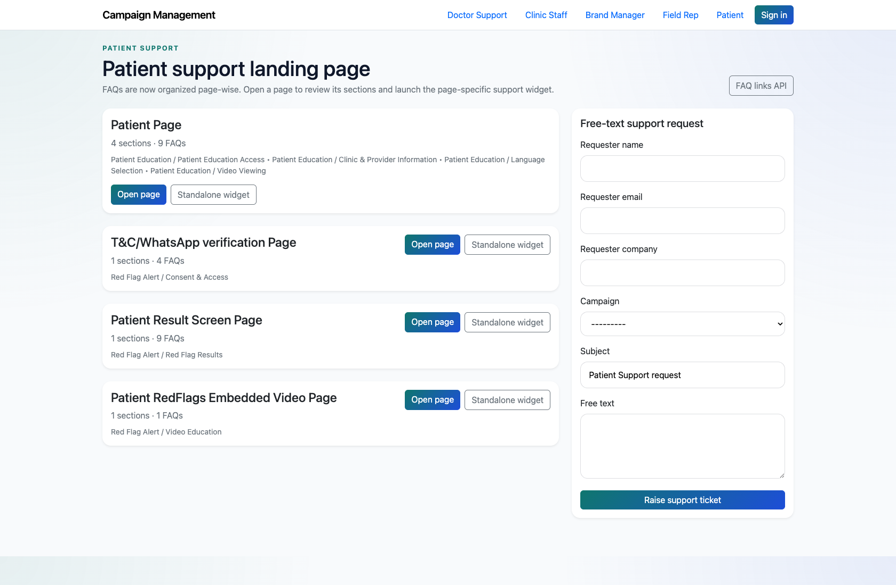
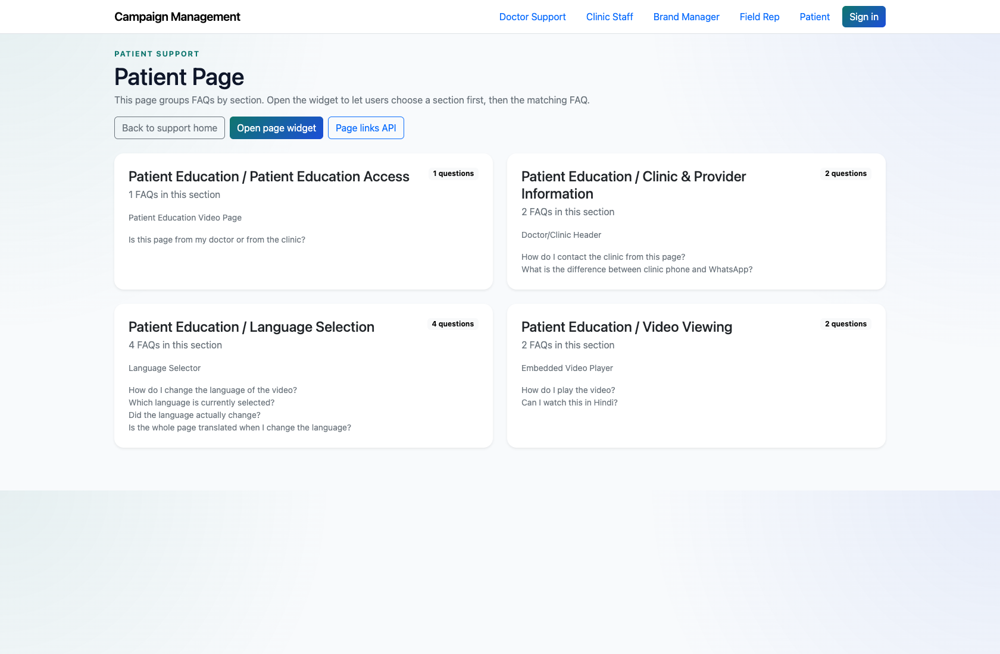
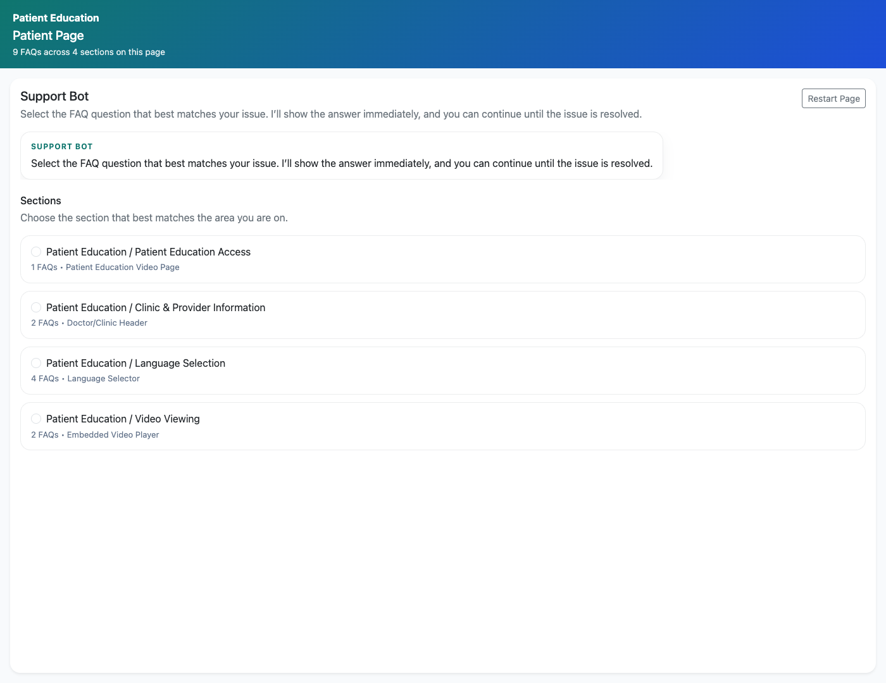

# Patient Self-Service Support

## Document Purpose

Document how patients reach patient-facing support pages and widgets for Patient Education and Red Flag Alert issues.

## Primary User

Patient

## Entry Point

`http://127.0.0.1:8002/support/patient/`

## Workflow Summary

- Patients use a dedicated support center with Patient Education and Red Flag Alert content.
- The support pages cover page-specific FAQs, while widgets provide a compact support-bot experience.
- Patients can escalate unresolved issues through the landing-page form or widget-driven support path.

## Step-By-Step Instructions

### Step 1. Open the Patient support center

- What the user does: Navigate to `/support/patient/`.
- What the user sees: A patient-facing support landing page with page-wise cards for patient content and Red Flag Alert flows.
- Why the step matters: This is the starting point for patient self-service in the live app.
- Expected result: The patient can identify the relevant page or journey without internal help.
- Common issues or trainer notes: The patient role page is intentionally simpler than the doctor and field-rep catalogs.
- Screenshot placeholder:
  - Suggested file path: `assets/patient-self-service-support/01-patient-landing.png`
  - Screenshot caption: Patient support landing page
  - What the screenshot should show: The patient role page with Patient Education and Red Flag Alert support cards.

### Step 2. Open a patient-facing FAQ page

- What the user does: Choose a page such as the patient page or Red Flag Alert result screen page.
- What the user sees: A page-wise FAQ experience tailored to patient issues.
- Why the step matters: This is the main content view for patient self-service.
- Expected result: The patient can review the available guidance before escalating.
- Common issues or trainer notes: Choose a page with recognizably patient-friendly wording when presenting to client teams.
- Screenshot placeholder:
  - Suggested file path: `assets/patient-self-service-support/02-patient-faq-page.png`
  - Screenshot caption: Patient FAQ page
  - What the screenshot should show: A patient-facing FAQ page with page-level support content.

### Step 3. Use the widget for embedded support

- What the user does: Open a standalone patient widget for one of the patient pages.
- What the user sees: A compact support bot that can guide the patient through the page’s FAQs.
- Why the step matters: The widget is the most portable patient-facing support surface in the product.
- Expected result: The patient can access the same content in a smaller guided format.
- Common issues or trainer notes: This is a useful example when explaining how support content can be embedded in other patient journeys.
- Screenshot placeholder:
  - Suggested file path: `assets/patient-self-service-support/03-patient-widget.png`
  - Screenshot caption: Patient support widget
  - What the screenshot should show: The patient widget experience for a page-level support topic.

### Step 4. Escalate when self-service does not resolve the issue

- What the user does: Use the support form or unresolved-issue path if a patient answer is missing.
- What the user sees: A capture form that routes the issue into the internal support workflow.
- Why the step matters: This prevents patient issues from stalling when FAQ coverage is incomplete.
- Expected result: The unresolved issue is recorded for internal review.
- Common issues or trainer notes: Keep the language client-friendly during training, since this role is often shown to external audiences.
- Screenshot placeholder:
  - Suggested file path: `assets/patient-self-service-support/04-patient-free-text-form.png`
  - Screenshot caption: Patient support request form
  - What the screenshot should show: The patient role page’s support request form used for escalation.

## Success Criteria

- Patients can navigate the role page, page-wise FAQs, and widgets without help.
- Patients know there is still an escalation path if the FAQ does not resolve the issue.

## Related Documents

- `README.md`
- `docs/support-widget-integration.md`

## Status

Live-verified against the patient support center, page view, and widget on 2026-04-11.
