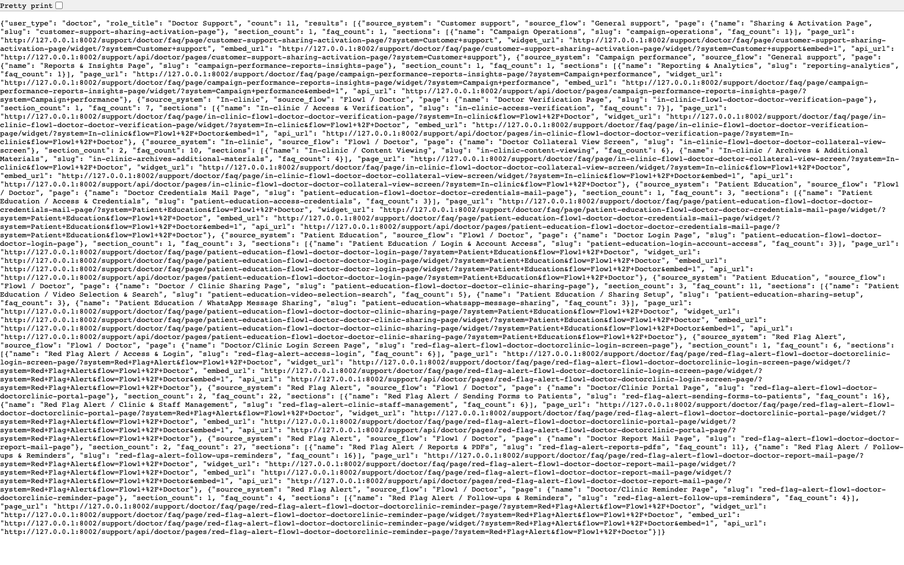
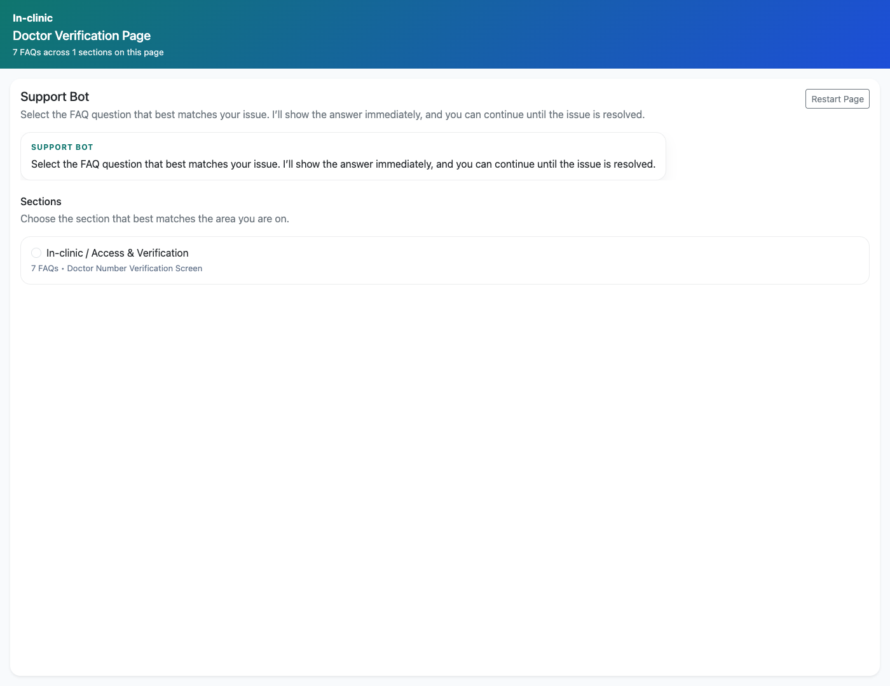
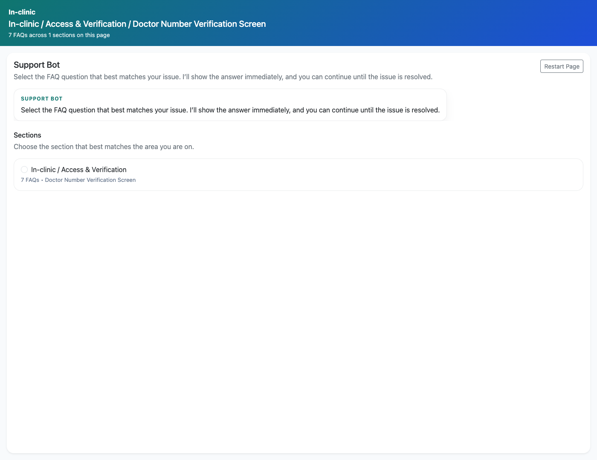

# Support Widget Integration

## Document Purpose

Document how an implementation partner or trainer discovers the available support links and uses the embeddable widget endpoints.

## Primary User

Implementation partner, trainer, or technical owner embedding support content into another property.

## Entry Point

`http://127.0.0.1:8002/support/api/doctor/faq-links/`

## Workflow Summary

- The application exposes JSON link catalogs and embeddable page-wise or combination widgets for role-specific support content.
- Partners can use the FAQ links API to discover available pages and then embed a widget URL in another product surface.
- Unresolved issues raised from widgets still flow back into the PM review queue, preserving the support context.

## Step-By-Step Instructions

### Step 1. Inspect the FAQ links API

- What the user does: Open a FAQ links API endpoint such as `/support/api/doctor/faq-links/`.
- What the user sees: A JSON payload listing the supported pages, URLs, and counts for the selected role.
- Why the step matters: This is the discovery layer for downstream integration and link export.
- Expected result: The implementation owner can identify which page or widget URL to embed.
- Common issues or trainer notes: The repo also includes exported link files in `docs/` for quick reference.
- Screenshot placeholder:
  - Suggested file path: `assets/support-widget-integration/01-faq-links-api.png`
  - Screenshot caption: FAQ links API response
  - What the screenshot should show: The JSON response from a FAQ links API endpoint used to discover support pages.

### Step 2. Open a page-wise widget

- What the user does: Use one of the returned widget URLs and open it in standalone mode or with `?embed=1`.
- What the user sees: A compact support bot with section selection, question selection, and unresolved issue capture.
- Why the step matters: This is the embeddable support surface that partner systems can consume directly.
- Expected result: The widget is ready to embed into another system or training environment.
- Common issues or trainer notes: The widget is intentionally iframe-friendly and optimized for compact support access.
- Screenshot placeholder:
  - Suggested file path: `assets/support-widget-integration/02-page-wise-widget.png`
  - Screenshot caption: Page-wise support widget
  - What the screenshot should show: A standalone page-wise widget showing the compact support bot experience.

### Step 3. Open a combination widget

- What the user does: Use a category-level widget endpoint for a role and open it in standalone mode.
- What the user sees: A category-specific widget showing questions for a narrower support slice.
- Why the step matters: Combination widgets support more targeted embed scenarios than full page-wise widgets.
- Expected result: The implementation owner understands when to use page-wise versus category-level widgets.
- Common issues or trainer notes: This distinction is helpful when integrating into screen-specific help drawers or microsites.
- Screenshot placeholder:
  - Suggested file path: `assets/support-widget-integration/03-combination-widget.png`
  - Screenshot caption: Combination support widget
  - What the screenshot should show: A category-specific widget for a narrower support context.

### Step 4. Understand the escalation handoff

- What the user does: Review how unresolved widget issues move into the PM review queue.
- What the user sees: A consistent escalation path that preserves widget context and PM-review routing.
- Why the step matters: Partners need to know that embedded support still feeds the internal operations workflow.
- Expected result: The integration owner can explain how widget-originated support issues are handled downstream.
- Common issues or trainer notes: Reference the PM review workflow deck when teaching the full end-to-end escalation path.
- Screenshot placeholder:
  - Suggested file path: `assets/support-widget-integration/04-widget-escalation-context.png`
  - Screenshot caption: Widget escalation context
  - What the screenshot should show: A widget view or PM queue screenshot that demonstrates the preserved support context.

## Success Criteria

- A partner can find the available support pages and widgets for a role.
- A partner understands how embedded support escalations continue into PM review.

## Related Documents

- `README.md`
- `docs/support-widget-integration.md`
- `docs/support-widget-links.md`
- `docs/support-widget-page-links.md`

## Status

Live-verified against the FAQ links API and rendered widgets on 2026-04-11.
